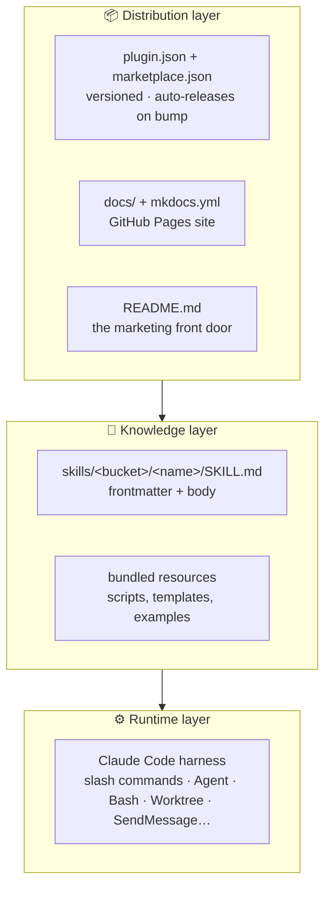

# Plugin architecture

This page is for **contributors** — how the plugin is built, not how to
use it. If you're here to use the skills, you want
[The loop](workflow.md) and the [Skills overview](skills/index.md)
instead.

The plugin is organised as three concentric layers, each with a different
job and a different audience.

| Layer | What lives there | Who reads it |
|---|---|---|
| **Runtime** | Claude Code itself — slash commands, the `Agent` tool, `Monitor`, `SendMessage`, `Worktree`. | The skill body, at execution time. |
| **Knowledge** | 28 `SKILL.md` files. Markdown with YAML frontmatter that tells the harness *when* to fire. Sibling resource files (scripts, templates) referenced by relative paths. | Claude Code loads the relevant `SKILL.md` as context when the skill activates. |
| **Distribution** | `plugin.json` (the manifest), `marketplace.json` (the catalogue entry), the docs site, the README. | Users discovering, installing, and updating the plugin. |

!!! info "Why this matters when revising skills"
    Anything you add to a `SKILL.md` body becomes runtime context tokens —
    so keep it tight. Visual aids and long-form explanation belong on the
    docs-site pages (the loop, the deep-dives), **not** in the `SKILL.md`.

## The bucket layout

Skills live under `skills/<bucket>/<name>/SKILL.md`. Buckets are
**organisational only** — a skill's *role in the loop* matters more than
which folder it sits in.

| Bucket | What's in it |
|---|---|
| `engineering/` | Daily code-work skills — the bulk of the loop. |
| `productivity/` | Daily non-code workflow tools (`grill-me`, `timesheet`, `caveman`, `handoff`, `writing-great-skills`). |
| `misc/` | Kept around but rarely reached for (`edit-article`, `setup-pre-commit`, `steampipe`). |
| `remote-agents/` | The overnight loop (`afk-fanout`, `afk-worker`, `morning-review`). |

## Keeping the catalogue in sync

A skill must be cited in **five** places, all kept in lockstep — adding or
removing one means touching all five:

1. `.claude-plugin/plugin.json` — entry in the `skills` array.
2. Top-level `README.md` — one-line description in the matching bucket.
3. `skills/<bucket>/README.md` — one-line description.
4. `docs/skills/index.md` — bullet under the matching bucket.
5. `mkdocs.yml` — nav line under the matching bucket.

Per-skill pages under `docs/skills/<name>.md` are **auto-generated** from
each `SKILL.md` by `scripts/mkdocs_hooks/skill_pages.py` — don't edit them
by hand. `mkdocs build --strict` runs on every docs-touching push to
`main`, so a stale nav entry fails the GitHub Pages deploy.

!!! warning "The total skill count is hand-maintained"
    The Knowledge-layer row above hard-codes the total number of
    `SKILL.md` files (28). It is *not* auto-generated and the strict build
    does *not* catch a stale number — bump it whenever you add or remove a
    skill. Verify with `grep -c './skills/' .claude-plugin/plugin.json`.

## Releasing a version

See [Contributing → Versioning](contributing.md#versioning) for the
release workflow — `plugin.json` and `marketplace.json` must stay in
sync, and a push that bumps the version triggers
`.github/workflows/release.yml`, which validates the changelog and cuts a
`v<version>` GitHub Release.

## See also

- [Contributing](contributing.md) — how to add a skill, the book-rules workflow, building the docs.
- [The loop](workflow.md) — what the skills compose into, for users.
- [Skills overview](skills/index.md) — the full catalogue.
