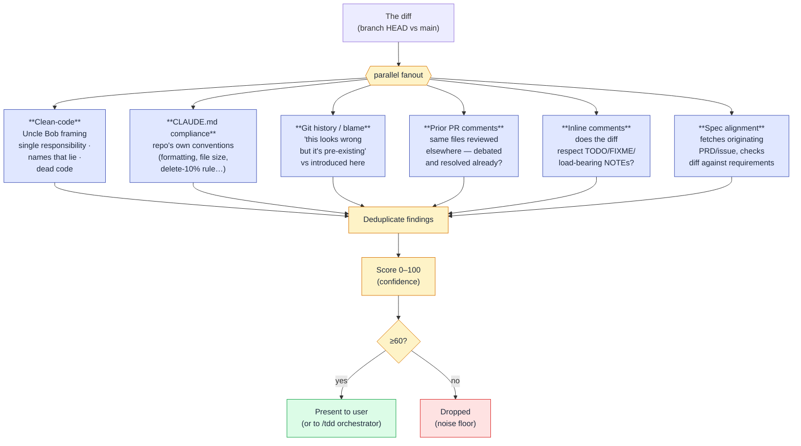
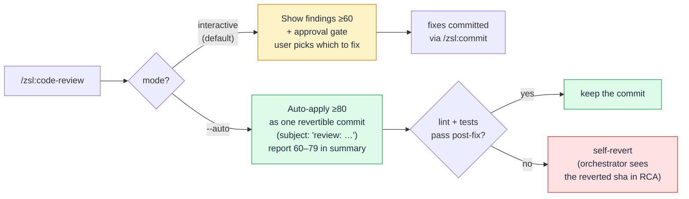
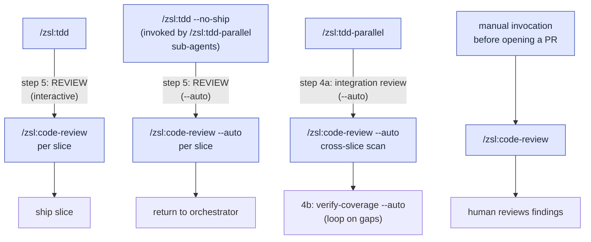

# Code review deep-dive

`/zsl:code-review` is the most parallelised skill in the plugin after
`/zsl:tdd-parallel`. It runs **six concurrent sub-agents**, each reading
the same diff through a different lens, then deduplicates and
confidence-scores their findings before showing them to you.

If you want the spec, see [`skills/code-review`](skills/code-review.md).
This page covers the *why* — what each lens contributes, why the
confidence scoring exists, and how interactive vs `--auto` modes differ.

## The six lenses

Three things to notice:

1. **Lenses are independent.** Each sub-agent reads the diff and its own
   anchor (`CLAUDE.md`, `git log`, prior PR comments, the PRD…) — no
   coordination between lenses, no shared state. A single big prompt
   would have to balance attention across all six concerns at once and
   would underweight whichever showed up last; six small prompts each
   read everything with full attention.
2. **Dedup before scoring.** Two lenses surfacing the same issue from
   different angles compound into one finding with higher confidence,
   not two duplicates. A bug the clean-code lens spotted that also
   violates a CLAUDE.md rule lands as a single, very high-confidence
   item.
3. **The <60 floor is the noise gate.** Single-lens, low-confidence
   findings get filtered out so the approval gate isn't drowned in
   maybe-issues. This is the difference between a review you act on and
   one you skim.

## What each lens catches

| Lens | Designed to surface |
|---|---|
| **Clean-code** | Uncle Bob's standards applied to the diff: single-responsibility violations, names that lie or obscure, functions too large to hold in your head, dead code, comments that explain *what* instead of *why*, mixed concerns, behavior changes without test changes, modified `.env*` files. |
| **CLAUDE.md compliance** | Repo-specific rules the author may have skipped — file-size caps, the delete-10% rule, the `@/*` import alias, "no `any`", the line-length convention, anything codified in the root or directory-local `CLAUDE.md`. |
| **Git history / blame** | "This looks wrong, but…" — runs `git blame` on each modified hunk so it can tell pre-existing bugs from bugs the diff introduced. Also catches the inverse: a line was added in PR #X to handle edge case Y, and the new change breaks that. |
| **Prior PR comments** | Uses `gh pr list --search` to find previous PRs touching the same files, reads their review comments, and re-surfaces guidance that applies again. The "we already debated this on PR #142" lens — every team has it and it lives in one reviewer's head; this lens reads it back. |
| **Inline comments** | Reads existing comments in the modified files. If a TODO/FIXME/`// NOTE: load-bearing` says "don't do X here" and the diff does X, the lens flags it. |
| **Spec alignment** | Looks up the originating spec — commit-message references like `Closes #123`, then a user-passed path, then a PRD/AGENT-BRIEF under `docs/`, `specs/`, or `.scratch/` matching the branch slug — and checks the diff against it. Three failure modes: missing requirements, scope creep, and wrong-implementation findings. Each finding quotes the relevant spec line. Returns "no spec available" and skips itself if nothing's found. |

The first five lenses shipped together in 0.8.0 as part of the rewrite
that made `/zsl:code-review` a first-class part of the loop. The Spec
lens was added in 0.9.0, inspired by upstream's two-axis `/review`
skill — merged as one more lens in the existing parallel scan rather
than a separate skill, so confidence scoring still composes across all
six.

## Confidence scoring

Every collected finding gets scored 0–100 before presentation:

- **0–25** — Doesn't survive light scrutiny, or it's a pre-existing
  issue on lines the branch didn't touch.
- **50** — Real but low-impact. Nitpicky relative to the rest of the
  diff.
- **75** — Verified real, will hit in practice, or directly violates
  CLAUDE.md.
- **100** — Concrete evidence the issue is real and frequent.

Two scoring properties matter:

1. **Cross-lens agreement raises confidence.** Two independent lenses
   flagging the same `file:line` is much stronger evidence than one
   lens flagging it twice — the dedup step compounds them, not the
   raw count.
2. **The 60 floor is calibrated for the approval gate.** Below 60 is
   the band of findings where the cost of reading them outweighs the
   chance of acting on them. Drop them and the gate becomes signal,
   not noise.

The ≥80 threshold for `--auto` auto-apply is set higher than the
60 floor for a reason: dropping a maybe-issue costs nothing, but
auto-applying a wrong fix costs a revert and a halt. ≥80 keeps the
false-positive rate of auto-applied changes low enough that the
self-revert path (run lint+tests; revert and halt on failure) is the
exceptional path, not the routine one.

## Interactive vs `--auto`

The interactive mode is the default and the differentiator versus
Claude Code's built-in `/review`: you stay in the loop and decide what's
worth fixing. The agent proposes a fix plan — which findings it'll
address, which to skip and why, which look like false positives — and
waits for explicit approval before editing. After fixes it runs `make
lint` (or the project's equivalent) and the result lands via `/zsl:commit`.

`--auto` mode is for AFK contexts. It drops the approval gate, applies
every ≥80 finding, and commits them as a single follow-up with subject
`review: <one-line summary>` — one `git revert` undoes the entire pass.
It then runs lint and tests; if either fails, it `git revert`s the
review commit and halts with the failure surfaced. Findings in the
60–79 band are *reported* but not applied — they ride out in the
return summary as a **Deferred review findings** section for the
orchestrator (or the integration PR body) to carry forward.

## Where it fires in the loop

Three call sites with different shapes:

- **Per-slice, inside `/zsl:tdd` step 5.** Catches what the author
  missed on a single slice before it ships. Interactive in normal
  invocation; `--auto` when `/zsl:tdd` runs under `--no-ship` (which is
  what `/zsl:tdd-parallel` sub-agents do).
- **Integration review, inside `/zsl:tdd-parallel` step 4a.** Fires
  `--auto` against the merged PRD tip *after every wave has integrated*.
  The per-slice reviews can't see across slices; this pass can —
  duplicate helpers between slices, redundant imports after merge,
  drift between two slices that converged on the same area, debug
  leftovers no single slice introduced alone. A failure here reverts
  the review commit and surfaces the reverted sha in the orchestrator's
  RCA so you can `git show <sha>` to see what it attempted.
- **Standalone, before opening a PR by hand.** The pre-PR scan for
  branches that didn't come through `/zsl:tdd` (a quick fix, a
  prototype merge, a refactor branch). The approval gate stays in
  force; you decide.

The interactive approval gate is what makes per-slice review tolerable
inside `/zsl:tdd` — you see a focused list, decide what's worth fixing,
and ship. The `--auto` path makes the integration review tolerable
inside `/zsl:tdd-parallel` — there's no human to gate on at the end of
a multi-wave fanout, so the high-confidence threshold + self-revert
discipline does the gating instead.

## Why parallel agents, not one big prompt

The 0.8.0 rewrite split a single-pass review into the five-lens
parallel scan (Spec joined as the sixth in 0.9.0). Two reasons that
keep paying off:

**Attention budget.** A monolithic review prompt has to weigh six
concerns at once, and it underweights whichever shows up last in the
prompt. Six small prompts each get full attention on their one job —
the git-blame lens reads `git log` with intent because that's *all*
it's reading; the prior-PR-comments lens makes the `gh pr list` call
because that's *all* it's doing. Specialisation lets each lens go
deeper than a generalist pass could.

**Independent failure modes.** A lens that returns nothing because
its anchor doesn't exist (no `CLAUDE.md`, no prior PRs, no spec) is
just a quiet null — it doesn't drag down the other five. A single
monolithic prompt that loses thread on one concern tends to lose
thread on adjacent ones; isolating lenses isolates failures.

The genericisation pass in 0.8.0 also stripped Sentry / coverage /
SQL / Supabase-specific heuristics out of the review skill — they
didn't belong in a portable skill. The remaining three "Before
suggesting changes" principles (match existing conventions, trust
enforcement layers, don't push abstraction prematurely) are universal,
and the rest of the lensing is the structural answer to "what would a
good reviewer actually look at?"

## Constraints

- **Harness-bound: needs Claude Code's `Agent` tool.** Six sub-agents
  spawn in one message. A harness without parallel sub-agents would
  have to serialise the lenses, which defeats the attention-budget
  argument above and would multiply review latency by six.
- **`--auto` needs `make lint` (or equivalent) and a test runner.**
  The self-revert safety net depends on being able to run lint and
  tests automatically after the fix commit. A project with no
  lint/test entry point falls back to "lint-only revert" — riskier;
  the integration review halt is more likely to fire.
- **`--auto` does not stay in conversation.** It returns a single
  message — auto-applied count, deferred 60–79 list, lint/test status —
  and stops. Don't invoke `--auto` if you want to discuss findings;
  use interactive mode.
- **The Spec lens is best-effort.** If no spec is reachable (no
  `Closes #N` in commits, no user-passed path, no matching file under
  `docs/`/`specs/`/`.scratch/`), the lens skips itself and the other
  five carry the review. Don't rely on Spec alignment as a hard gate.

## See also

- [`/zsl:code-review` spec](skills/code-review.md) — the SKILL.md body, the source of truth for behaviour.
- [The loop — Ship](workflow.md#ship) — where `/zsl:code-review` sits in the end-to-end loop.
- [Parallel TDD deep-dive](tdd-parallel.md) — the other multi-agent skill in the plugin, and the one that invokes `--auto` at step 4a.
- [`/zsl:tdd` spec](skills/tdd.md) — the per-slice flow that fires `/zsl:code-review` as step 5.
- [Workflow](workflow.md) — the loop walkthrough with slash-command examples.
