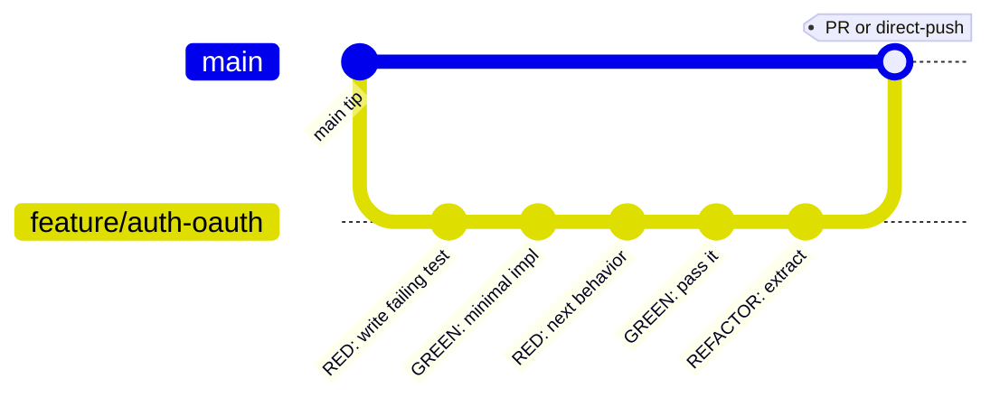
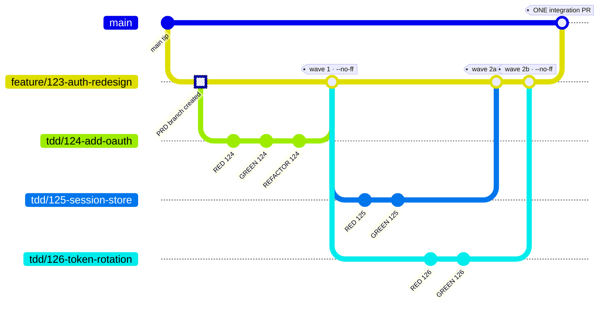
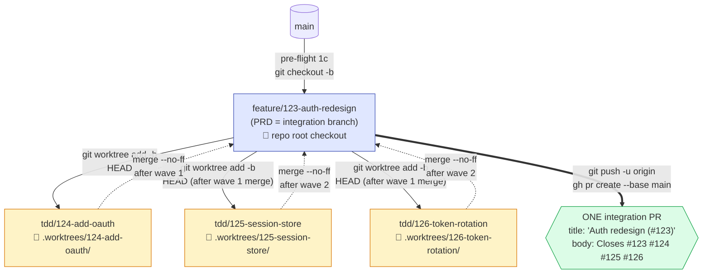
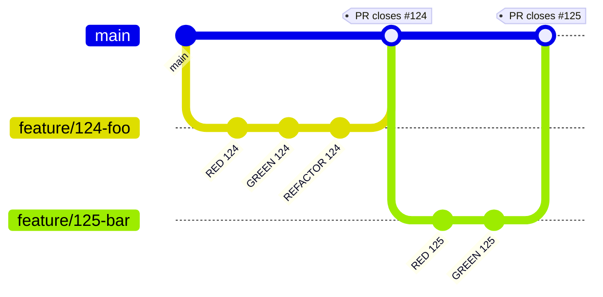
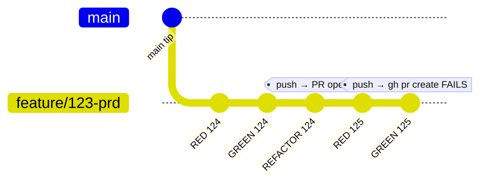
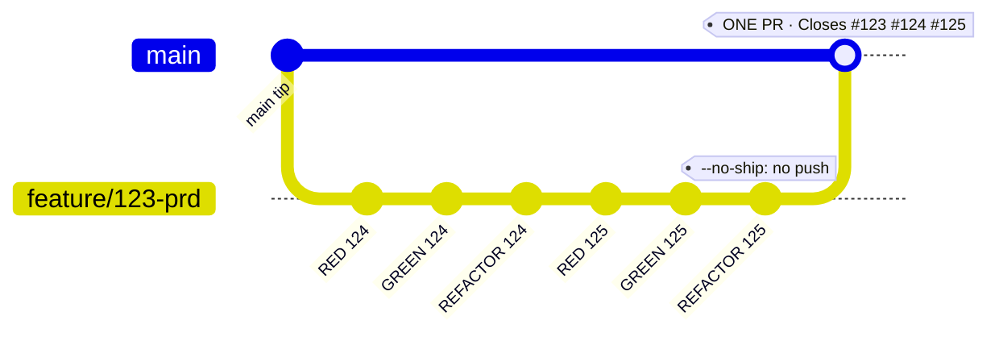
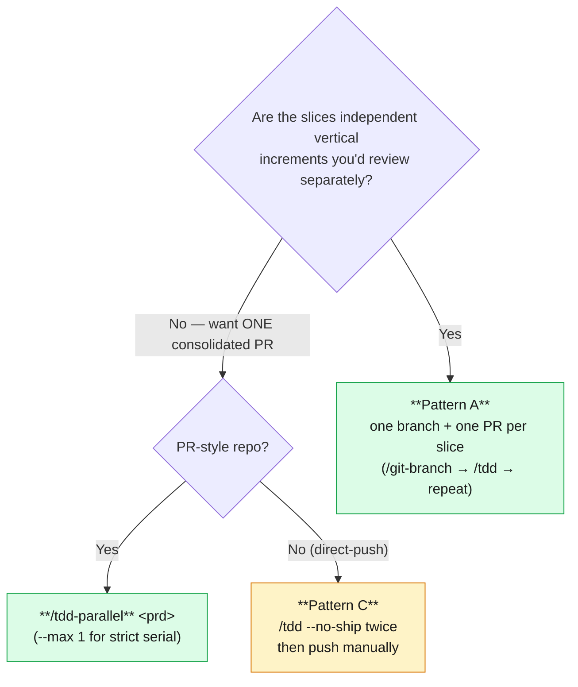

# Git branching in the build phase

Branching is where [`/zsl:tdd`](../skills/tdd.md) and
[`/zsl:tdd-parallel`](../skills/tdd-parallel.md) diverge most. Standalone
`/zsl:tdd` works on whatever branch you hand it. `/zsl:tdd-parallel` stages
an entire multi-branch dance and consolidates it into one PR. Both reach
back to `docs/agents/ship-style.md` to decide whether the slice gets a PR
or a direct push.

This page is the single source of truth for "what branches exist, where,
and why." If you're trying to plan a fanout — or recover from one that
halted — start here.

## Standalone `/zsl:tdd`

`/zsl:tdd` doesn't create branches — it inherits the caller's current
branch. Typically you create that branch yourself with
[`/zsl:git-branch`](../skills/git-branch.md) first
(`feature/<name>`, `fix/<name>`, etc.), then call `/zsl:tdd` against a
single sub-task.

At step 5 (*Ship it*), `/zsl:tdd` reads `docs/agents/ship-style.md` and
branches:

| Ship style | What `/zsl:tdd` does | How the sub-task closes |
|---|---|---|
| `PR-style` | Pushes the branch, opens a PR via [`/zsl:commit`](../skills/commit.md) | `Closes #<sub-task>` in the **PR body** |
| `direct-push` | Pushes the branch; you merge by hand | `Closes #<sub-task>` in the **commit body** (replaces the `Sub-task:` line) |
| Local-markdown tracker | Flips `Status:` to `shipped` + `git mv` the issue file into `issues/done/` — in the same commit as the slice's code | The folder move is the close. Prompts to archive the whole feature if it's now empty. |

## `/zsl:tdd-parallel` orchestration

The orchestrator manages **three layers of branches** at once. The trick
is that the parent **PRD branch doubles as the integration branch**:
slice work doesn't merge to `main` directly — it merges to the PRD
branch, and the PRD branch is pushed exactly once at the end as a single
integration PR.

The same picture as a layered flowchart, with the worktree filesystem
layout alongside the branch model:

## Naming convention

| Object | Pattern | Created by | Lifespan |
|---|---|---|---|
| PRD branch | `feature/<parent-num>-<slug>` (slug ≤ 40 chars, kebab-case of parent title) | Pre-flight 1c — only if orchestrator is on `main`; otherwise the current branch is adopted | Until integration PR merges |
| Slice branch | `tdd/<num>-<slug>` | Step 3c, `git worktree add -b … HEAD` | Until manual `git branch -d` or pre-flight 1b sweep on next run |
| Worktree dir | `.worktrees/<num>-<slug>/` | Step 3c, same command. `.worktrees/` is added to `.gitignore` if missing. | Same as slice branch |

## Why `--no-ff` and why one PR

!!! info "Two interlocking reasons"

    **Each slice merge is `--no-ff`** so the integration history preserves a
    clear "this is where wave N landed" merge commit. You can read the wave
    shape off `git log --first-parent feature/<parent>` later.

    **One PR, not N PRs**, because every push triggers CI. *N* slices × *M*
    CI workflows over the life of a fanout = wasted minutes. Staging slice
    work locally and pushing one consolidated branch costs one CI run. The
    trade-off is no per-slice review granularity; this is acceptable because
    [`/zsl:to-issues`](../skills/to-issues.md)'s wave model already asserts
    same-wave slices are disjoint.

## Inheritance: how later waves see earlier work

When wave 2 starts, the orchestrator runs `git worktree add … HEAD` from
the **current PRD tip**, which already contains wave 1's merges. So slice
`tdd/125-session-store` can safely import code from `tdd/124-add-oauth` —
it's just sitting in the parent. This is why **same-wave slices must be
disjoint**: they can't see each other yet.

## Halt and inspect: where things end up if it stops mid-flight

| Halt cause | Where the orchestrator leaves you | What survives |
|---|---|---|
| Agent failure (step 3d) | On the PRD branch, the failing slice's worktree intact at `.worktrees/<num>-<slug>/` | Partial slice commits on `tdd/<num>-<slug>`; agent's heartbeat file is final-state evidence |
| Unresolvable merge conflict (step 3e) | **On the PRD branch, mid-merge** — no `git merge --abort`. Resolve in place. | Conflict markers in place; the source slice branch unchanged; `git diff --check` shows conflicted files |
| Zero-progress halt (step 3a) | On the PRD branch with whatever has merged so far | Un-attempted slices' `Blocked by` sections reveal cycles, external refs, or non-existent issue refs |

!!! warning "The orchestrator never `--force`s anything"
    `git branch -d` refuses on unmerged branches and the pre-flight skips
    them (logged as *skipped — unmerged branch*). `git worktree remove`
    runs without `--force` so uncommitted changes block removal. Resume is
    the user's job — the orchestrator does not auto-retry.

## Running multiple `/zsl:tdd`s in series by hand

A natural question: *"Do I even need `/zsl:tdd-parallel`? Can't I just
branch the PRD, then run `/zsl:tdd` twice in a row?"* Short answer:
**`/zsl:tdd` was not designed for this** — it doesn't create per-slice
branches, it commits on whatever branch you hand it, and it tries to ship
at step 5. Three patterns are possible; only one and a half work cleanly.

### Pattern A — separate branches per `/zsl:tdd` (the well-defined path)

You branch off `main` for each slice. The "PRD feature branch" is
conceptual, not a real branch.

Two PRs, merged independently. The PRD parent (`#123`) closes
automatically only when *all* its children close (GitHub) or when you run
the feature-level `git mv` (local-markdown).

### Pattern B — both `/zsl:tdd`s on the same `feature/123-prd` branch (broken)

This is probably what you're picturing. It runs into a real edge case:

What actually happens, step by step:

| Step | Result |
|---|---|
| `/zsl:tdd 124` commits | 2–3 commits on `feature/123-prd` |
| `/zsl:tdd 124` step 5 (PR-style) | pushes branch, opens PR `feature/123-prd → main` with `Closes #124` |
| `/zsl:tdd 125` commits | 2–3 more commits on the same branch |
| `/zsl:tdd 125` step 5 | push fast-forwards into the **existing** PR; `gh pr create` refuses ("already exists for branch"); the skill stalls or asks you what to do |

!!! danger "Effect"
    Both slices end up in *one* PR that closes only `#124`. `#125` closes
    only if you manually edit the PR body to add `Closes #125`. Direct-push
    mode is slightly cleaner — both commits land on `main` and each
    `Closes #<n>` in the commit body works — but you've still pushed twice
    (2× CI runs).

### Pattern C — `--no-ship` twice, then ship manually

This is the only way to get `/zsl:tdd-parallel`-style behavior without
the orchestrator:

You're recreating `/zsl:tdd-parallel` minus the worktrees and concurrency.
`--no-ship` is officially "used by `/zsl:tdd-parallel`" but nothing stops
you calling it directly. You'd then push manually and write the
integration PR body yourself.

### Recommendation: decision tree

In priority order:

1. **Pattern A is the default.** Each slice is a vertical tracer bullet
   that earns its own PR. Zero ambiguity, no shared-branch interleaving,
   independent rollback, matches the `[AFK|HITL] <wave><letter>` slice
   format `/zsl:to-issues` produces. The "cost" is N CI runs for N slices,
   but you were going to queue them anyway.

2. **If you specifically want one consolidated PR — just use
   `/zsl:tdd-parallel`.** Even with two slices. The `--max N` flag caps
   *within-wave* concurrency, so set `--max 1` for strict serial
   execution while keeping the consolidation machinery.

3. **Manual bundle (Pattern C) — only when `/zsl:tdd-parallel` is
   off-limits.** Direct-push repos can't run `/zsl:tdd-parallel`. If
   you're in one and want bundling, this is the one case where Pattern C
   is the right answer.

## See also

- [Parallel TDD deep-dive](../tdd-parallel.md) — design rationale and the wave model
- [`/zsl:tdd-parallel` spec](../skills/tdd-parallel.md)
- [`/zsl:tdd` spec](../skills/tdd.md)
- [`/zsl:git-branch`](../skills/git-branch.md) — branch-name conventions
