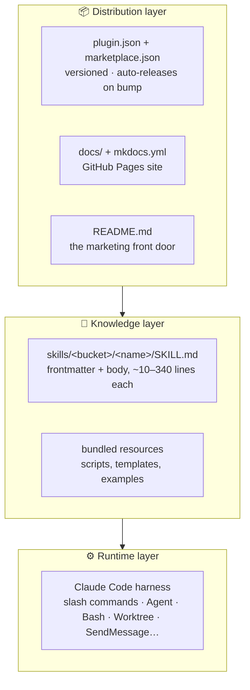

# Concepts

Mental models for the plugin. If the [quickstart](../quickstart.md) tells
you *what to type* and the [skill pages](../skills/index.md) tell you
*what each skill does*, this section tells you **how the pieces fit
together** — the architecture, the loop, the state machine, the
branching.

Read these once and the per-skill pages become a reference rather than
a tutorial.

## The three concentric layers

The plugin is organised as three layers, each with a different job and
a different audience.

| Layer | What lives there | Who reads it |
|---|---|---|
| **Runtime** | Claude Code itself — slash commands, the `Agent` tool, `Monitor`, `SendMessage`, `Worktree`. | The skill body, at execution time. |
| **Knowledge** | 23 `SKILL.md` files. Markdown with YAML frontmatter that tells the harness *when* to fire. Sibling resource files (scripts, templates) referenced by relative paths. | Claude Code loads the relevant SKILL.md as context when the skill activates. |
| **Distribution** | `plugin.json` (the manifest), `marketplace.json` (the catalogue entry), the docs site, the README. | Users discovering, installing, and updating the plugin. |

!!! info "Why this matters when revising skills"
    Anything you add to a SKILL.md body becomes runtime context tokens —
    so keep it tight. Visual aids and long-form explanation belong in the
    Concepts pages (here) and the deep-dive pages, not in the SKILL.md.

## What's in this section

[The loop](the-loop.md)
:   The end-to-end engineering workflow the skills compose into. Five
    phases — plan, break down, build, ship, track — plus the
    cross-cutting helpers.

[The triage state machine](state-machine.md)
:   Every issue carries one category role and one state role. Seven
    states, the transitions between them, and how the state mirrors to a
    GitHub project board.

[Git branching in the build phase](branching.md)
:   The single source of truth for `/zsl:tdd` vs `/zsl:tdd-parallel`
    branching: standalone topology, three-layer parallel topology,
    naming, halt semantics, and "what if I just run `/zsl:tdd` twice?".

## See also

- [Workflow](../workflow.md) — the canonical loop walkthrough with the
  skill names attached to each phase.
- [Parallel TDD deep-dive](../tdd-parallel.md) — design rationale for
  the most distinctive skill in the plugin.
- [Code review deep-dive](../code-review.md) — design rationale for `/zsl:code-review`'s six-lens parallel scan
- [Skills overview](../skills/index.md) — every skill, with a "which one
  do I want?" decision tree.
