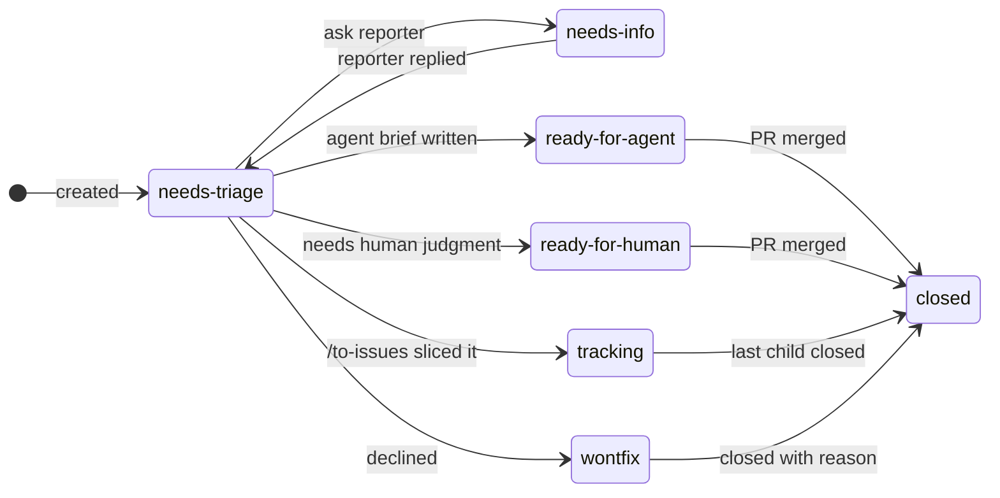
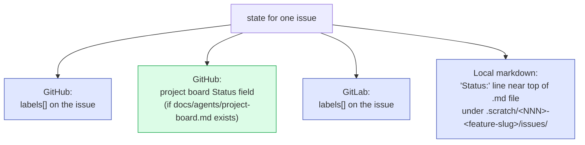

# The triage state machine

Every issue under the loop carries exactly **two** labels: one
*category* role and one *state* role.
[`/zsl:triage`](../skills/triage.md) is just an interactive walk of the
state machine; [`/zsl:to-issues`](../skills/to-issues.md) and
[`/zsl:to-prd`](../skills/to-prd.md) write into it; and the project
board (if configured) mirrors it.

## Roles

| Role kind | Values | What it means |
|---|---|---|
| **Category** | `bug` | Something is broken |
| | `enhancement` | New feature or improvement |
| **State** | `needs-triage` | Maintainer needs to evaluate |
| | `needs-info` | Waiting on reporter for more information |
| | `ready-for-agent` | Fully specified, ready for an AFK agent |
| | `ready-for-human` | Needs human implementation (judgment, access, design) |
| | `tracking` | Container/parent issue (e.g. a PRD) whose work lives in the children |
| | `wontfix` | Will not be actioned |

!!! info "Canonical names ≠ label strings"
    The roles above are canonical. The actual label *strings* used in
    your tracker may differ — the mapping is in `docs/agents/triage-labels.md`,
    written by [`/zsl:setup-zsl-superpowers`](../setup.md).

## The states and transitions

| From → To | Trigger | Who initiates |
|---|---|---|
| `(none)` → `needs-triage` | Issue created | Reporter (any source) |
| `needs-triage` → `needs-info` | Maintainer wants more from reporter | `/zsl:triage` posts a templated comment |
| `needs-info` → `needs-triage` | Reporter replies | `/zsl:triage` (re-evaluating) |
| `needs-triage` → `ready-for-agent` | Maintainer accepted, brief written | `/zsl:triage` (with `AGENT-BRIEF.md` template) |
| `needs-triage` → `ready-for-human` | Maintainer accepted, can't be delegated | `/zsl:triage` |
| `needs-triage` → `tracking` | Issue is a container, sliced into children | `/zsl:to-issues` (auto, when slicing the parent) |
| `needs-triage` → `wontfix` | Declined | `/zsl:triage` (writes `.out-of-scope/` for enhancements) |
| `ready-for-agent` → closed | PR merged | Tracker auto-close (`Closes #N`) |
| `ready-for-human` → closed | PR merged | Tracker auto-close |
| `tracking` → closed | Last child closed | Tracker auto-close (GitHub) or prompted `git mv` (local-markdown) |

!!! note "PRDs you authored yourself skip `needs-triage`"
    Since [`/zsl:to-prd`](../skills/to-prd.md) v0.3.x, PRDs land with
    `ready-for-agent` directly — you already grilled yourself; the
    triage round-trip would be redundant.

## Project board mirror (GitHub only)

When `docs/agents/project-board.md` exists, every state-role change is
mirrored to the project board's `Status` field. The mapping is set up
during [`/zsl:setup-zsl-superpowers`](../setup.md) and looks something
like:

| State label | Typical Status option | Lifecycle moment |
|---|---|---|
| `needs-triage` | `Backlog` | Just landed |
| `needs-info` | `Blocked` | Waiting on reporter |
| `ready-for-agent` | `Ready` | Brief written, pickable |
| `ready-for-human` | `Ready` | Same column, different role |
| `(in tdd loop)` | `In progress` | `/zsl:tdd` step 1 sets this |
| `(PR open, PR-style)` | `In review` | `/zsl:tdd` step 6 (or `/zsl:tdd-parallel` step 4c) sets this |
| `tracking` | `Tracking` (custom option) | Parent of an active fanout |
| `(closed)` | `Done` | GitHub `Auto-close` workflow handles this |
| `wontfix` | `Done` | Declined with reason |

The exact Status option names depend on what's configured in
`docs/agents/project-board.md`. The board sync is **best-effort**: if
the GraphQL update fails, the label change still stands and triage
surfaces the error rather than rolling back.

## Where state lives, by tracker backend

- **GitHub** — labels are the source of truth; the project board is a
  best-effort mirror.
- **GitLab** — labels only; no board mirroring.
- **Local markdown** — the `Status:` line is the truth, and closure is
  folder-based (`git mv` between `issues/` and `issues/done/`, then the
  whole feature folder into `.scratch/done/` when finished). Nothing is
  ever deleted.

## See also

- [`/zsl:triage`](../skills/triage.md) — the skill that walks the
  machine. Includes the agent-brief and out-of-scope templates.
- [`/zsl:to-issues`](../skills/to-issues.md) — the only skill that sets
  `tracking` automatically.
- [The loop](../workflow.md) — how triage fits into the end-to-end flow.
