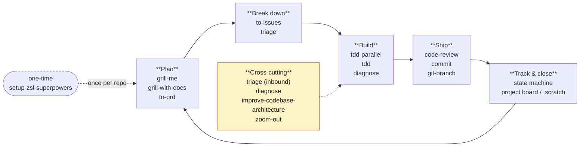
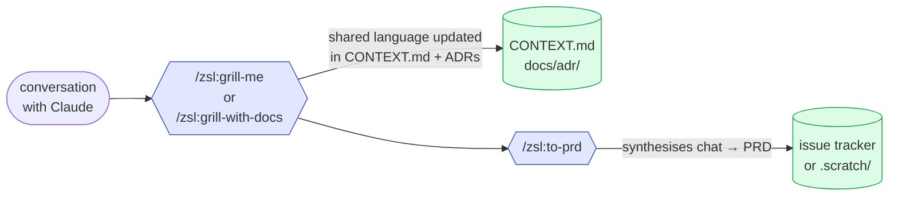
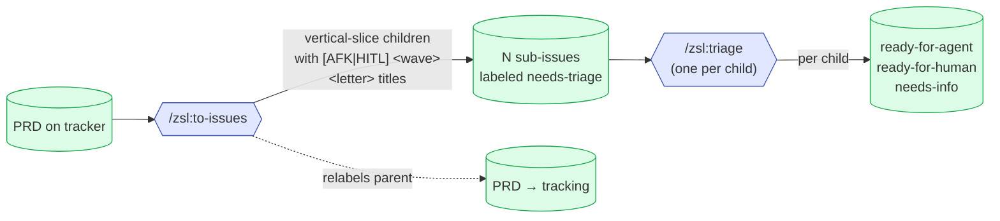
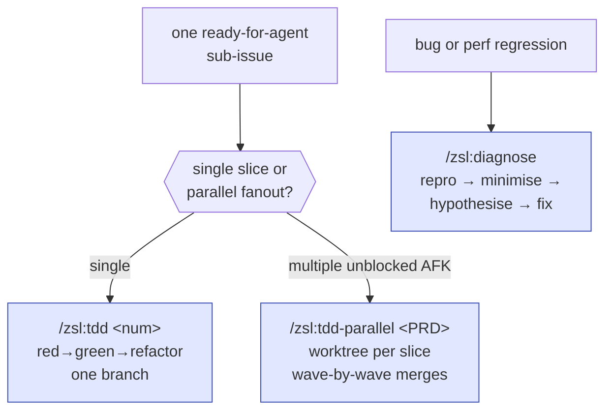
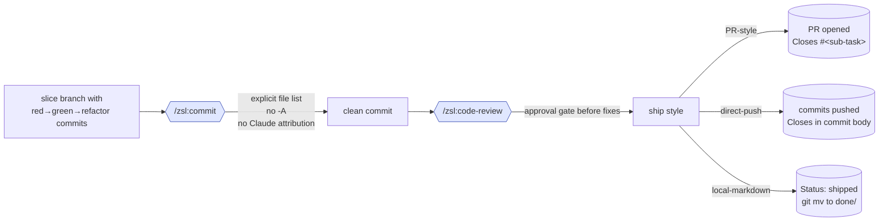
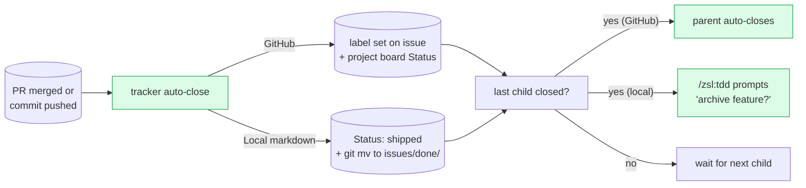

# The loop

The plugin's skills compose into one end-to-end engineering loop. Most
days you only touch a few of them; the loop tells you which skill picks
up where the previous one left off, and which ones sit on the side as
cross-cutting helpers.

The [workflow page](../workflow.md) is the canonical walkthrough with
slash-command examples. This page is the **conceptual map** — the
phases, what each phase produces, and what flows between them.

## The five phases

| Phase | Produces | Consumed by |
|---|---|---|
| **Plan** | A PRD issue on the tracker (or a `.scratch/<feature>/PRD.md`) describing what you're building and why | Break down |
| **Break down** | A set of vertical-slice sub-issues with `[AFK\|HITL] <wave><letter>` titles and `Blocked by` graphs, each triaged to a state | Build |
| **Build** | Slice branches with red-green-refactor commits, each closing one sub-issue | Ship |
| **Ship** | A merged PR (or pushed commit) per slice, *or* one consolidated integration PR for an AFK fanout | Track |
| **Track & close** | Closed issues. The PRD parent auto-closes when its last child closes. | Next loop |

## Phase 1: Plan

[`/zsl:grill-me`](../skills/grill-me.md) and
[`/zsl:grill-with-docs`](../skills/grill-with-docs.md) interview you
relentlessly about a plan or design until every branch of the decision
tree is resolved. The `with-docs` variant also updates your `CONTEXT.md`
(the shared language) and ADRs (the decisions) inline — that's the lever
that cuts agent verbosity over time.

Once the conversation feels concrete, [`/zsl:to-prd`](../skills/to-prd.md)
synthesises it into a PRD on the tracker. No interview — just packaging
what you've already discussed.

!!! tip "The grilling step is the highest-leverage one"
    The most common failure mode in agent-coded software is
    misalignment — you think the agent knows what you want, then you
    see what it built. Spending five minutes here costs orders of
    magnitude less than re-doing work later.

## Phase 2: Break down

[`/zsl:to-issues`](../skills/to-issues.md) breaks the PRD into
vertical-slice sub-issues. The `[AFK|HITL] <wave><letter>` title format
is the **dependency contract** that the rest of the loop consumes:

- `[AFK]` = the agent can run it unattended
- `[HITL]` = needs human in the loop mid-flight
- `<wave>` = serialisation level (wave 1 before wave 2)
- `<letter>` = parallelism within a wave (same wave = disjoint)

Then [`/zsl:triage`](../skills/triage.md) walks each child through the
state machine. See [the state machine page](state-machine.md) for the
full transition map.

## Phase 3: Build

This is where the two TDD skills diverge — see
[the branching page](branching.md) for the full topology.

[`/zsl:tdd`](../skills/tdd.md) handles a single sub-issue with the
red-green-refactor loop on whatever branch you're on.
[`/zsl:tdd-parallel`](../skills/tdd-parallel.md) fans out the unblocked
`[AFK]` slices into worktrees and consolidates everything into one
integration PR.

[`/zsl:diagnose`](../skills/diagnose.md) sits beside both — the
disciplined bug/perf-regression loop you use when something specific is
broken rather than when you're building new behavior.

## Phase 4: Ship

[`/zsl:commit`](../skills/commit.md) is non-negotiable for the
commit-crafting step: explicit file lists (never `git add -A`), no
Claude attribution, sub-task and parent issue references in the body.

[`/zsl:code-review`](../skills/code-review.md) runs an issues-only
pre-PR review with an approval gate before applying any fixes — so the
review itself doesn't silently mutate your branch.

Ship behaviour depends on `docs/agents/ship-style.md` (written by
[`/zsl:setup-zsl-superpowers`](../setup.md)). See
[the branching page](branching.md#standalone-zsltdd) for the matrix.

## Phase 5: Track & close

State storage and closure depend on the tracker you picked in
`/zsl:setup-zsl-superpowers`:

- **GitHub project dashboard** — state lives as labels mirrored to the
  project board's `Status` field. PR merge → GitHub closes the child.
  Last child closes → GitHub auto-closes the `tracking` parent.
- **Local markdown** — state is the `Status:` line in each `.md`. Closure
  is folder-based, atomic with the slice commit. Feature-level archive
  is prompted, never automatic.

See [the state machine page](state-machine.md) for the full transition
policy.

## The cross-cutting band

Some skills don't belong to a single phase — they run *across* the
loop:

| Skill | When to reach for it |
|---|---|
| [`/zsl:triage`](../skills/triage.md) | Inbound bug reports / feature requests from outside the loop, or re-evaluating stale issues |
| [`/zsl:diagnose`](../skills/diagnose.md) | Hard bugs and performance regressions, regardless of which phase you're in |
| [`/zsl:improve-codebase-architecture`](../skills/improve-codebase-architecture.md) | Every few days, to fight entropy. Surfaces deepening opportunities informed by `CONTEXT.md` + ADRs |
| [`/zsl:zoom-out`](../skills/zoom-out.md) | Whenever you're lost in a section of code and need higher-level framing |
| [`/zsl:prototype`](../skills/prototype.md) | Off-loop: throwaway exploration of a state machine or UI direction before you commit to a PRD |

## See also

- [Workflow](../workflow.md) — the same loop with slash-command examples and the canonical phase descriptions
- [The triage state machine](state-machine.md) — how issues move between states
- [Git branching in the build phase](branching.md) — what the Build phase actually does to your git tree
