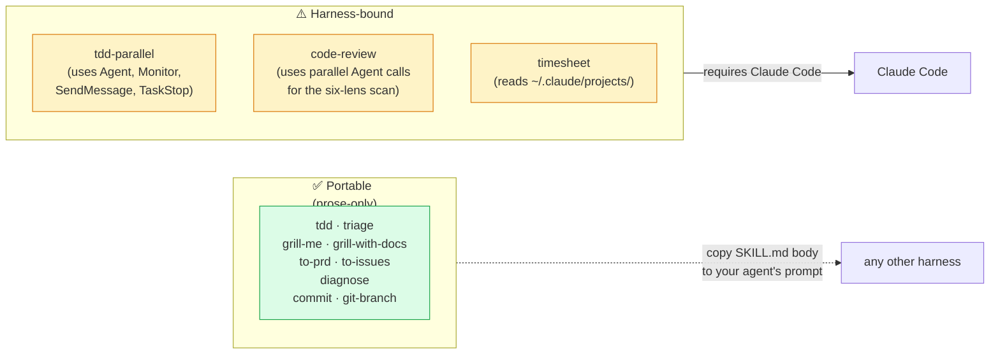
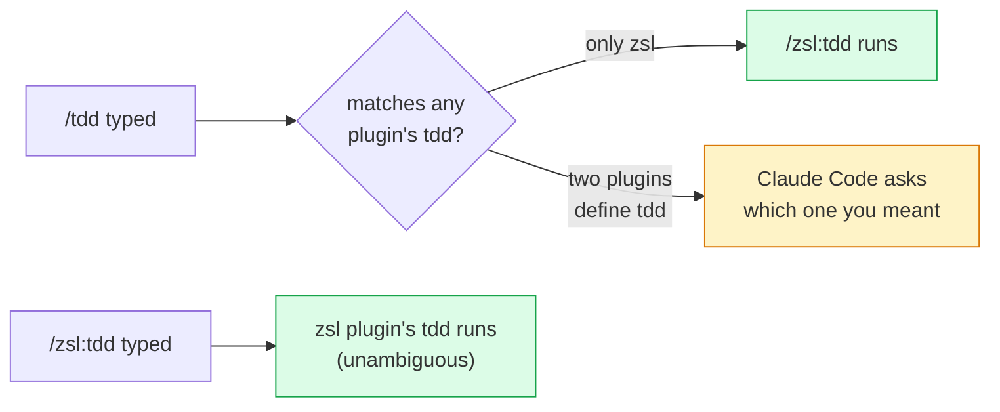
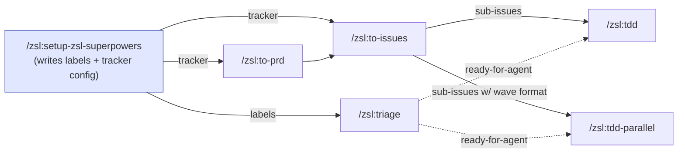
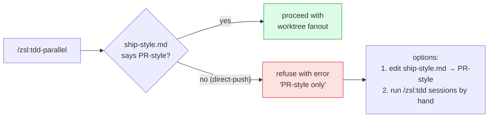
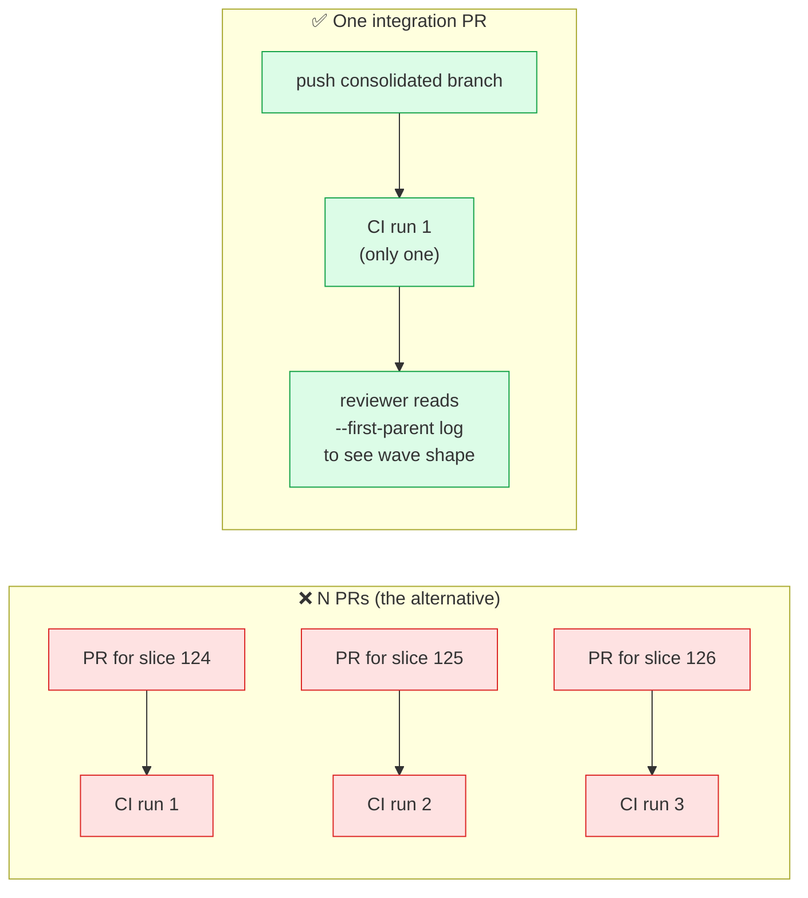

# FAQ

## Compatibility

### Does this work with Codex / Cursor / Cline / [other agent]?

The skills are mostly model-agnostic prose, but **harness-specific in places**.
Single-skill prose ones (the TDD red-green-refactor loop, the triage state
machine, the grilling skills) are largely portable — the content describes a
practice, not a tool surface. Multi-agent ones — [`tdd-parallel`](skills/tdd-parallel.md)
and now [`code-review`](skills/code-review.md), which runs six concurrent
sub-agents for its multi-lens scan — reference Claude Code's tool surface
directly (`Agent`, `Monitor`, `Bash` with `run_in_background`, `SendMessage`,
`TaskStop`) because they orchestrate sub-agents and need real primitives, not
abstractions.



The **delivery mechanism** is also Claude Code: skills surface via
`/plugin install` and route through Claude Code's slash-command and skill-matching
infrastructure.

To use them outside Claude Code today you'd manually copy the SKILL.md content
of the skills you want into your agent's system prompt (losing auto-trigger),
and for multi-agent skills, translate the Claude Code tool calls into your
harness's equivalents — the orchestration shape carries over; the API doesn't.
There's no first-class adapter for other harnesses.

If you maintain another agent harness and want a clean integration, open an
issue — we'd take a PR.

### Does it work with non-Anthropic models inside Claude Code?

Yes. The skills don't assume a specific model. They've been used with Opus,
Sonnet, and Haiku family models without modification.

### Why is everything namespaced as `/zsl:`?

Claude Code applies the plugin name as a prefix to every skill it owns, so
`/zsl:tdd` is the plugin's `tdd` skill specifically. This avoids collisions if
you install another plugin that also defines a `tdd` skill.



You can drop the `zsl:` prefix only inside the *plugin's own* development setup
(e.g. when hacking on the plugin from a local clone). In normal use, type the
full `/zsl:<name>` form.

## Privacy & telemetry

### Does the plugin phone home?

No. See [Privacy](privacy.md). The plugin runs entirely inside your local
Claude Code session. No telemetry, no analytics, no remote calls to
ZunoSmartLabs infrastructure.

### Does the docs site track me?

No. `superpowers.zsl.dev` is a static GitHub Pages site with no analytics,
cookies, forms, or sign-ups. GitHub serves the page and may log standard request
metadata under their own infrastructure logging.

## Using the plugin

### Can I use only some skills?

Yes. Skills are independent. If you only want the productivity ones
([`grill-me`](skills/grill-me.md), [`timesheet`](skills/timesheet.md),
[`caveman`](skills/caveman.md), [`write-a-skill`](skills/write-a-skill.md)),
ignore the engineering skills — nothing forces you to run `setup-zsl-superpowers`.

The engineering skills do depend on each other, though: `/zsl:tdd-parallel`
expects sub-issues sliced by `/zsl:to-issues`; `/zsl:triage` expects the labels
from `/zsl:setup-zsl-superpowers`. You can use any of them on their own, but the
end-to-end loop assumes the chain.



If you don't run `setup-zsl-superpowers`, the engineering skills bail
with a setup hint instead of guessing.

### When should I use `/zsl:handoff` vs Claude Code's `/clear`?

Different problems. `/clear` wipes the conversation immediately and gives you a blank slate — useful when you want to drop context and start fresh. [`/zsl:handoff`](skills/handoff.md) does the opposite: it *preserves* the substantive context (state at handoff, open decisions, suggested next skills, pointers to artifacts) into a tmp-dir markdown file so the **next session** can pick up cleanly.

Rule of thumb:

- **Run `/zsl:handoff` first**, then `/clear` (or close the session) — you keep the handoff file as a bridge.
- If the next agent is a different person, `cat <handoff-path>` is faster than catching them up by hand.
- The handoff file lives in `$TMPDIR` / `%TEMP%` and is treated as ephemeral; secrets are redacted before writing.

### How do I update?

```
/plugin marketplace update zsl-superpowers
```

Then restart Claude Code. (`/plugin update <name>` is not a real command —
`/plugin` on its own opens the plugin manager UI, and any trailing argument is
ignored. Marketplace update + restart is the actual update path.)

After updating, skim the [changelog](changelog.md) for version-specific upgrade
notes — breaking-ish releases include an **Upgrading from X.Y** block with any
migration steps.

### How do I uninstall?

```
/plugin uninstall zsl@zsl-superpowers
/plugin marketplace remove zsl-superpowers
```

The plugin's per-repo config (`AGENTS.md` / `CLAUDE.md` blocks, `docs/agents/`
files) stays in place — it's just markdown. Delete it by hand if you want it
gone.

### Why don't the engineering skills know about my repo?

Run [`/zsl:setup-zsl-superpowers`](setup.md) once per repo. The skills read
`docs/agents/issue-tracker.md`, `docs/agents/triage-labels.md`, and
`docs/agents/ship-style.md` to know what tracker, label vocabulary, and ship
style to use. If those files don't exist, the skills bail with a setup hint.

### How do I hack on the skills locally?

Clone the repo and register the path as a local marketplace:

```bash
git clone git@github.com:ZunoSmartLabs/zsl-superpowers.git ~/code/zsl-superpowers
```

```
/plugin marketplace add ~/code/zsl-superpowers
/plugin install zsl@zsl-superpowers
```

Then `git pull` and `/plugin marketplace update zsl-superpowers` (and restart
Claude Code) whenever you want your changes picked up.

See [Contributing](contributing.md) for how to add a new skill.

## Troubleshooting

### A skill that should auto-trigger isn't triggering

A few things to check:

- The skill might have `disable-model-invocation: true`. Those are
  user-invocable only — call them explicitly with `/zsl:<name>`.
  ([`grill-with-docs`](skills/grill-with-docs.md),
  [`tdd-parallel`](skills/tdd-parallel.md),
  [`setup-zsl-superpowers`](skills/setup-zsl-superpowers.md), and
  [`zoom-out`](skills/zoom-out.md) are all user-invocable only by design.)
- The trigger phrases are listed verbatim on each skill's page (and in its
  `SKILL.md` frontmatter `description:` field). If your prompt doesn't match,
  rephrase or invoke explicitly.

### `/zsl:tdd-parallel` refuses with "ship-style not PR"

It's PR-style only. Direct-push repos can't consolidate into a single
integration PR by definition. Either switch the repo to PR-style for the
duration (edit `docs/agents/ship-style.md`), or run individual `/zsl:tdd`
sessions in parallel by hand.



### Lost a slice worktree, can I recover?

Yes — pre-flight 1b in [`/zsl:tdd-parallel`](skills/tdd-parallel.md) only sweeps
worktrees whose corresponding issue is **closed** and whose working tree is
clean. Anything open or with uncommitted changes is left in place. Inspect
`.worktrees/<num>-<slug>/` directly.

## Project / philosophy

### Why no per-slice PR review?

Code review at slice granularity assumes slices are interesting independently of
each other. They aren't — they're vertical slices of one feature, designed to be
cohesive only as a set. The integration PR groups them in wave order with
`--no-ff` merge commits, so per-slice diffs are still inspectable, just inside
one PR review surface.



See [Git branching → "Why `--no-ff` and why one PR"](concepts/branching.md#why-no-ff-and-why-one-pr)
for the full rationale.

### Why TDD specifically?

Three reasons. (1) The agent has a fast deterministic pass/fail signal it can
loop against, which is the bottleneck on bug-finding. (2) The test is written
*before* the agent decides how to implement, so it can't quietly change the
spec. (3) Regression tests accumulate as a side effect — the more you ship via
this loop, the harder it gets to regress old behaviour.

### How is this different from frameworks like aider / Cline / [other]?

Those are agent harnesses. ZSL Superpowers is a *plugin for an agent harness*
(Claude Code), shaped as a set of small, opinionated skills you can adopt
piecemeal. There's no orchestration framework taking over your repo — each skill
is a markdown file you can read, fork, or replace.
