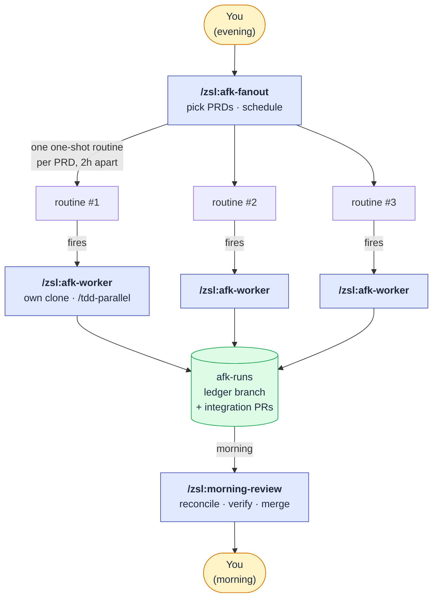
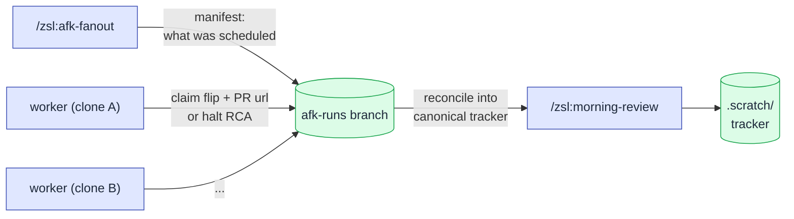

# Remote agents (overnight) deep-dive

The interactive [loop](workflow.md) keeps you in the chair: you drive
each skill from a local session. The **remote-agents loop** takes the
Build → Ship → Track stretch off your hands entirely — it runs PRDs
**unattended overnight**, one dedicated remote claude.ai session per PRD,
and hands you a stack of integration PRs to review in the morning.

If you want the specs, see
[`afk-fanout`](skills/afk-fanout.md),
[`afk-worker`](skills/afk-worker.md), and
[`morning-review`](skills/morning-review.md). This page covers the *why* —
the design decisions behind the loop.

## The shape: evening → overnight → morning

Three skills, three roles:

| Skill | When | Who's present | What it does |
|---|---|---|---|
| [`/zsl:afk-fanout`](skills/afk-fanout.md) | Evening | You | Shows the queue of `tracking` PRDs with `ready-for-agent` children; you pick which to run and in what order; it schedules one one-shot remote routine per PRD. |
| [`/zsl:afk-worker`](skills/afk-worker.md) | Overnight | Nobody | The per-PRD executor each routine fires. Runs `/zsl:tdd-parallel` unattended in its own clone, opens one integration PR, records the outcome. |
| [`/zsl:morning-review`](skills/morning-review.md) | Morning | You | Reconciles what ran, then walks you through the PRs to verify and merge, halted slices, and no-result PRDs. |

The human is the **dispatcher**, not the operator: all the judgment about
*which* PRDs are worth overnight budget goes into `/zsl:afk-fanout`, once,
interactively. The autonomy lives downstream.

## Why one isolated session per PRD

The obvious way to run several PRDs unattended is **one scheduled session
that works through them in a loop**. The loop deliberately doesn't do this,
for the same reason `/zsl:tdd-parallel` can't run two PRDs in one checkout:
it treats its working tree as the integration surface. Stack several PRDs
into one session and you get the worst of three worlds —

- **Serial only.** Each `/zsl:tdd-parallel` run owns the branch and PR for
  its PRD, so they can't overlap — PRD #2 waits for PRD #1 to finish.
- **Token bunching.** A single session runs every PRD's fan-out back to
  back, concentrating the whole night's token cost into one continuous
  burst — straight into the per-5h cap (see below).
- **One failure sinks the batch.** A crash, timeout, or dirty-tree halt on
  one PRD ends the session, and every remaining PRD never runs.

`/zsl:tdd-parallel` already fans *slices* out into parallel worktrees, but
those worktrees share one checkout and one orchestrator — fine within a
PRD, useless across them. So the remote loop fans out **one level higher:
one whole clone per PRD.** Each `/zsl:afk-worker` gets its own clone,
working tree, and branch. Workers never race each other, and a PRD that
gets stuck — a dirty tree, an unresolvable conflict, a halt — can't take
down the others; the failure stays contained to the one clone that hit it.
That per-PRD isolation is the entire reason fan-out happens at the
*session* level rather than just the worktree level.

## How the routines are scheduled

Each PRD is scheduled as a **native one-off routine** — a claude.ai routine
with a `run_once_at` timestamp that fires once at its slot and then
auto-disables. There's no recurring cron to disable or sweep afterwards;
spent routines just sit in the list marked as run.

One-off runs are **exempt from the per-day routine cap**, so scheduling a
full night of workers never spends your routine quota — each draws ordinary
subscription usage like any other session. That leaves exactly one ceiling
that matters: **tokens.**

A fleet of `/zsl:tdd-parallel` runs (each spawning its own sub-agents) burns
tokens fast, and claude.ai enforces a per-5h-window cap. So the routines are
spaced a **fixed 2 hours apart**, not fired all at once — enough that a
single night's fan-out stays under the token cap instead of tripping it on
the first two PRDs and starving the rest. How many PRDs you can queue in one
night is bounded only by the overnight window and that token throttle —
never by a routine count.

## Partial runs: the enabler

An unattended worker can't stop to wait for a human. That's why the remote
loop depends on `/zsl:tdd-parallel`'s **partial runs** (shipped in 1.0):

> A run defers any slice whose `Blocked by` closure contains an open
> `[HITL]` slice, ships everything else in a **`[partial]` PR** that
> leaves the PRD open, and records the deferred work for re-entry.

Because the worker never hits a human gate mid-run, it always terminates
cleanly — either a full integration PR or a partial one — and never hangs
waiting on input nobody will give. See the
[partial-runs section of the parallel-TDD deep-dive](tdd-parallel.md#partial-runs-hitl-defers-it-doesnt-block)
for the mechanics. The worker also always passes
`--on-review-failure=continue` so a failed integration review rides into
the PR body for morning follow-up rather than halting the run.

## The `afk-runs` ledger

Each worker runs in an isolated clone, so its claim flips
(`scheduled → in-progress`) and halt RCAs can't reach `main` directly.
They're written instead as per-PRD entries on a shared **`afk-runs` git
branch** — a ledger. `/zsl:afk-fanout` writes a manifest there too (what
it scheduled), so the morning sweep can tell a worker that *ran and
halted* from one that *never fired or got throttled*.

[`/zsl:morning-review`](skills/morning-review.md) **reconciles** that
ledger into the canonical `.scratch/` tracker — replaying every
un-reconciled run, not just last night's — so the tracker ends up
reflecting what actually happened across the isolated clones.

## What the morning sweep surfaces

`/zsl:morning-review` does **not** auto-merge and does **not** deploy. It
sorts and surfaces, then you decide:

1. **Integration PRs to verify**, sorted by each slice's `verify-after:`
   tag — `local-run` and `staging` PRs first (the ones a green CI check
   can't fully validate), then `ci` PRs that are batch-mergeable after a
   quick diff skim.
2. **Scheduled-but-no-result PRDs** — cross-checked against the manifest,
   so a worker that never fired or got throttled isn't silently missed.
3. **Halted slices** parked in `needs-info`, with their RCAs, to re-triage.

## Constraints

- **claude.ai remote sessions.** The loop schedules remote routines via
  claude.ai; it's not a local cron job. `/zsl:afk-fanout` is the
  interactive dispatcher and `/zsl:afk-worker` is invoked *by the
  routine*, never by hand.
- **Local-markdown tracker.** The reconciliation step writes back into
  `.scratch/`; the loop is built around the local-markdown backend.
- **PR-style repos.** Each worker drives `/zsl:tdd-parallel`, which is
  PR-style only.
- **Telegram heads-up is best-effort.** Workers fire a Telegram notice on
  completion if configured; a missing config just means no notification,
  not a failed run.

## See also

- [The loop](workflow.md) — the interactive workflow the overnight loop automates.
- [Parallel TDD deep-dive](tdd-parallel.md) — what each worker actually runs, and the partial-runs mechanics.
- [`/zsl:afk-fanout`](skills/afk-fanout.md) · [`/zsl:afk-worker`](skills/afk-worker.md) · [`/zsl:morning-review`](skills/morning-review.md) — the skill specs.
