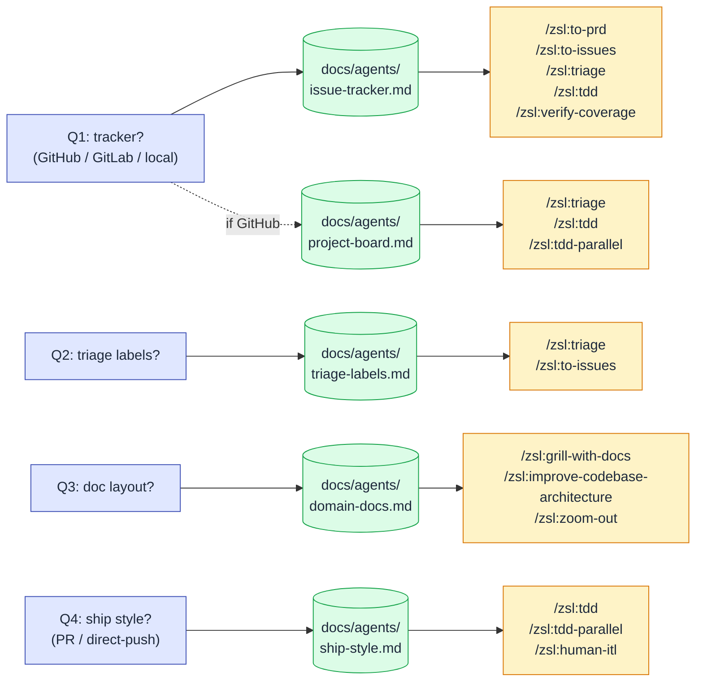

# Per-repo setup

Run `/zsl:setup-zsl-superpowers` in any repo where you want to use these skills. It will:

- Ask which **issue tracker** you use (GitHub, GitLab, or local markdown files).
- Ask which **labels** you apply when triaging issues (`/zsl:triage` uses these).
- Ask where to save the **per-repo docs** the skills consume.
- Ask which **ship style** the repo follows (PR or direct push).

The output lands in `AGENTS.md` (or `CLAUDE.md`), `docs/agents/`, and (for PR-style repos) the project board mapping at `docs/agents/project-board.md`.

## Configuration fanout

The four answers produce a small set of per-repo files that the engineering skills read at runtime. Each output file is consumed by a specific subset of skills.

If a skill needs config it can't find, it bails with a setup hint. Re-run `/zsl:setup-zsl-superpowers` to fix.

## Why this exists

The engineering skills in this plugin make assumptions about your repo's setup — *which issue tracker, what label vocabulary, where domain docs live, how you ship*. Rather than hard-code one opinion, `setup-zsl-superpowers` writes a small per-repo config that the other skills read.

`/zsl:to-issues`, `/zsl:to-prd`, `/zsl:triage`, `/zsl:diagnose`, `/zsl:tdd`, `/zsl:improve-codebase-architecture`, and `/zsl:zoom-out` all consume this config. If they appear to be missing context (don't know which tracker to use, can't find the right labels), it's because setup hasn't run.

## Three ship styles

The ship style controls what `/zsl:tdd` does at step 6 ("Ship it"). It's independent of which tracker you use.

| Ship style | What `/zsl:tdd` does at ship | Sub-task closure | Compatible trackers |
|---|---|---|---|
| **`PR-style`** | Pushes the slice branch and opens a PR via `gh pr create` | `Closes #<n>` in the PR body | GitHub, GitLab |
| **`direct-push`** | Pushes the slice branch; you merge it by hand | `Closes #<n>` in the **commit body** | GitHub, GitLab |
| **Local-markdown** | Flips `Status:` to `shipped` and `git mv`s the issue file into `issues/_done/` in the slice's commit | Folder move is the close. Prompts to archive the feature folder if `issues/` is empty | Local-markdown tracker only |

[`/zsl:tdd-parallel`](skills/tdd-parallel.md) is **PR-style only** — direct-push and local-markdown can't consolidate into a single integration PR by definition.

## Tracker backends

Two ways state is persisted, depending on Q1 above:

**GitHub project dashboard** — state lives as labels on each issue and is mirrored to the project board's `Status` field via the mapping in `docs/agents/project-board.md`. `/zsl:triage` updates both. Closure is automatic via GitHub's PR-merge → issue-close behaviour.

**Local markdown files** — state lives as a `Status:` line near the top of each `.md` file under `.scratch/<NNN>-<feature-slug>/`, where `<NNN>` is a 3-digit feature number assigned at creation (auto-incremented). Features can be addressed by number alone — `/zsl:triage 23` resolves to feature `023-*` via glob. Closure is folder-based: move issue files to `.scratch/<NNN>-<feature-slug>/issues/_done/` when complete, and the whole feature folder to `.scratch/_done/<YYYYMMDD>-<NNN>-<feature-slug>/` when shipped (date prefix orders archived features chronologically; the feature number stays embedded). Nothing is deleted; the archive records why each issue closed.

## When to re-run

Re-run `setup-zsl-superpowers` if:

- You change issue trackers (e.g. moved from local markdown to GitHub).
- You change your label vocabulary.
- The skills start asking questions that the config should already answer.
