# Skills

Every skill in the plugin, grouped by bucket. Each entry links to the
skill's own page — auto-generated from its `SKILL.md` so the site stays
in lockstep with the plugin source. Click any skill to see what triggers
it, what it does, and the full spec.

You can always invoke a skill explicitly with `/zsl:<name>`. Skills
without `disable-model-invocation: true` also auto-trigger when Claude
Code matches your prompt against the trigger phrases shown on each
skill's page.

## Which skill do I want?

If you're new here, follow the decision tree:

```mermaid
flowchart TB
    start{"What are you trying to do?"}
    plan["**Plan a new feature**"]
    breakdown["**Break a plan into work**"]
    build["**Build something**"]
    bug["**Hunt a bug or perf regression**"]
    review["**Ship work**"]
    inbox["**Manage incoming issues**"]
    health["**Fight codebase entropy**"]
    other["**Off the loop**"]

    start --> plan
    start --> breakdown
    start --> build
    start --> bug
    start --> review
    start --> inbox
    start --> health
    start --> other

    plan --> grill_me["/zsl:grill-me<br/>or<br/>/zsl:grill-with-docs<br/><i>(updates CONTEXT.md + ADRs)</i>"]:::plan
    plan --> to_prd["/zsl:to-prd<br/><i>synthesise the chat → PRD</i>"]:::plan

    breakdown --> to_issues["/zsl:to-issues<br/><i>PRD → vertical-slice children</i>"]:::breakdown
    breakdown --> triage_break["/zsl:triage<br/><i>walk each child to ready-for-agent</i>"]:::breakdown

    build --> single["one slice<br/>at a time"]
    build --> many["multiple unblocked<br/>[AFK] slices"]
    build --> manual["manual steps the<br/>agent can't do"]
    single --> tdd["/zsl:tdd"]:::build
    many --> tddp["/zsl:tdd-parallel"]:::build
    manual --> hitl["/zsl:human-itl<br/><i>clear skipped HITL slices</i>"]:::build

    bug --> diagnose["/zsl:diagnose"]:::diag

    review --> commit["/zsl:commit<br/><i>explicit file list</i>"]:::ship
    review --> code_review["/zsl:code-review<br/><i>pre-PR scan</i>"]:::ship
    review --> branch["/zsl:git-branch<br/><i>before /zsl:tdd</i>"]:::ship

    inbox --> triage_in["/zsl:triage"]:::cross

    health --> ica["/zsl:improve-codebase-architecture<br/><i>every few days</i>"]:::cross
    health --> zoom["/zsl:zoom-out<br/><i>lost in code</i>"]:::cross

    other --> prototype["/zsl:prototype<br/><i>throwaway exploration</i>"]:::misc
    other --> timesheet["/zsl:timesheet<br/><i>standup notes</i>"]:::misc
    other --> caveman["/zsl:caveman<br/><i>token-compressed replies</i>"]:::misc
    other --> write_a_skill["/zsl:write-a-skill<br/><i>author a new skill</i>"]:::misc

    classDef plan fill:#dbeafe,stroke:#2563eb;
    classDef breakdown fill:#e0e7ff,stroke:#4f46e5;
    classDef build fill:#fef3c7,stroke:#d97706;
    classDef diag fill:#fde68a,stroke:#b45309;
    classDef ship fill:#dcfce7,stroke:#16a34a;
    classDef cross fill:#fce7f3,stroke:#be185d;
    classDef misc fill:#f3f4f6,stroke:#6b7280;
```

For the conceptual map of how skills compose into one loop, see
[The loop](../concepts/the-loop.md).

## By role in the loop

Five phases plus cross-cutting helpers and off-loop standalones. Bucket
folders under `skills/` are organisational only — the **role** is what
matters for picking a skill.

### Plan

| Skill | What it does |
|---|---|
| [grill-with-docs](grill-with-docs.md) | Interview-driven planning. Sharpens terminology against `CONTEXT.md` and ADRs inline — the highest-leverage skill in the plugin. |
| [grill-me](grill-me.md) | Interview-only variant (no doc updates). Use for non-code planning. |
| [to-prd](to-prd.md) | Synthesise the current conversation into a PRD on the tracker. No interview — just packaging. |

### Break down

| Skill | What it does |
|---|---|
| [to-issues](to-issues.md) | Break the PRD into vertical-slice sub-issues with `[AFK\|HITL] <wave><letter>` titles and `Blocked by` graphs. Auto-relabels the parent to `tracking`. |
| [triage](triage.md) | Walk each child through the [state machine](../concepts/state-machine.md). Entry point for inbound issues too. |

### Build

| Skill | What it does |
|---|---|
| [tdd](tdd.md) | Single-issue red-green-refactor on whatever branch you hand it. |
| [tdd-parallel](tdd-parallel.md) | Fan unblocked `[AFK]` slices into worktrees, merge in wave order, open *one* integration PR. See the [deep-dive](../tdd-parallel.md). |
| [human-itl](human-itl.md) | Clear the `[HITL]` slices `/tdd-parallel` skipped — manual actions an agent can't perform — then hand back to the fanout. Hard-refuses disguised-decision slices. |
| [diagnose](diagnose.md) | Reproduce → minimise → hypothesise → instrument → fix → regression-test. The bug-hunting loop. |

### Ship

| Skill | What it does |
|---|---|
| [git-branch](git-branch.md) | Create a branch with the `feature/` / `fix/` / `chore/` prefix convention. Run this before `/zsl:tdd` when you don't already have a branch. |
| [commit](commit.md) | Explicit-file-list commits. No `git add -A`, no Claude attribution. |
| [code-review](code-review.md) | Pre-PR review of the current branch. Issues-only tone with an approval gate before applying fixes. |

### Cross-cutting

| Skill | When to reach for it |
|---|---|
| [improve-codebase-architecture](improve-codebase-architecture.md) | Every few days, to find deepening opportunities and fight entropy. |
| [zoom-out](zoom-out.md) | When you're lost in unfamiliar code and need higher-level framing. |

### Off-loop and meta

| Skill | What it does |
|---|---|
| [prototype](prototype.md) | Throwaway terminal app or radically-different UI variations. Flushes out a design before committing to a PRD. |
| [timesheet](timesheet.md) | Recent Claude Code session histories → copy/paste standup bullets, grouped by project. |
| [caveman](caveman.md) | Ultra-compressed reply mode (~75% token cut). |
| [write-a-skill](write-a-skill.md) | Author a new skill with proper progressive disclosure. |
| [setup-zsl-superpowers](setup-zsl-superpowers.md) | One-time per-repo scaffold. Run before any of the engineering loop skills. |
| [edit-article](edit-article.md) | Restructure and tighten article drafts. (Misc — rarely reached for.) |
| [setup-pre-commit](setup-pre-commit.md) | Husky + lint-staged + Prettier + type-check + tests. (Misc.) |
| [steampipe](steampipe.md) | AWS infra query reference. Auto-triggered only — not user-invocable. (Misc.) |

## See also

- [The loop](../concepts/the-loop.md) — how the skills compose into one workflow
- [Git branching in the build phase](../concepts/branching.md) — what `/zsl:tdd` and `/zsl:tdd-parallel` actually do to your tree
- [The triage state machine](../concepts/state-machine.md) — how issues move through the loop
