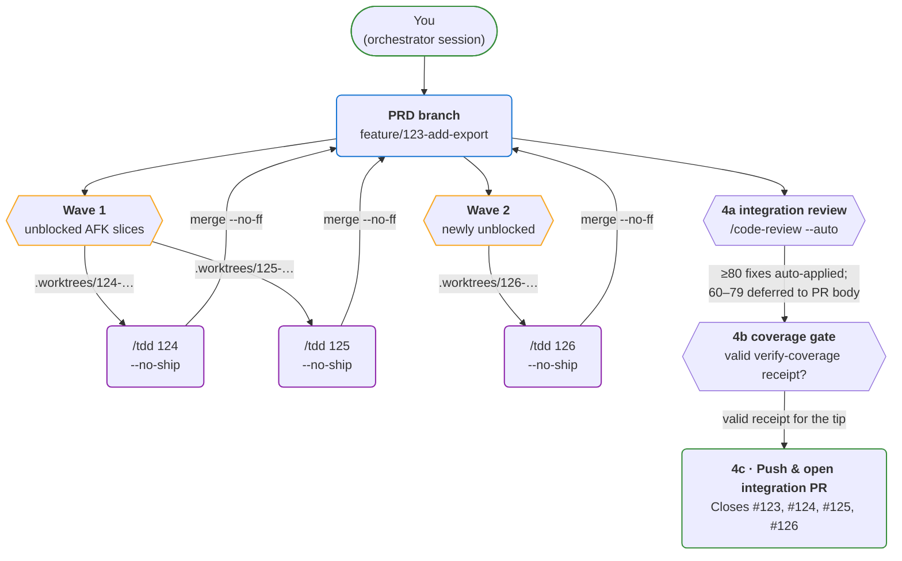
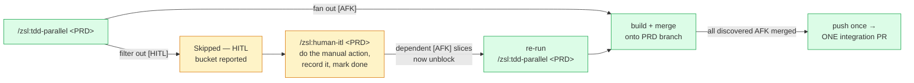

# Parallel TDD deep-dive

`tdd-parallel` is the most distinctive skill in the plugin. It fans the unblocked
`[AFK]` sub-issues of a parent (PRD) issue out into parallel `/tdd` sub-agents,
merges every slice branch onto the PRD branch in wave order, and opens **one**
consolidated integration PR.

If you want the spec, see [`skills/tdd-parallel`](skills/tdd-parallel.md). This
page covers the *why* — the design decisions you need to understand to use it
well.

!!! tip "Looking for the git topology?"
    The full branching picture (PRD branch ↔ slice branches, worktree
    layout, halt semantics, and *"what if I just run `/zsl:tdd` twice?"*)
    lives in [Concepts → Branching](concepts/branching.md). This page
    focuses on the design rationale; the branching page is the
    operational reference.

## The architecture



Three things to notice:

1. **The PRD branch is the integration surface.** Sub-agent branches are short-lived;
   the PRD branch accumulates merges across waves and gets pushed exactly once at
   the end.
2. **Worktrees, not clones.** Each slice agent works in `.worktrees/<num>-<slug>/`
   so they share object storage with the main checkout. Cheap to create, cheap to
   delete.
3. **Sub-agents commit but never push.** All push activity happens once, from the
   orchestrator, after every wave has merged cleanly.

## Why one PR

Each push to a feature branch triggers your CI workflows. With N sub-issues = N
PRs you'd pay N × M CI runs over the life of a fanout. Staging slice work locally
and pushing one consolidated branch costs **one CI run.**

Trade-offs to know about:

- **One PR is one review surface.** No per-slice review granularity. If your team
  does line-by-line review per slice, this isn't the right tool.
- **Merge conflicts surface during local integration**, not during PR review.
  Same-wave slices should be disjoint by construction (that's what
  [`/zsl:to-issues`](skills/to-issues.md)'s wave model asserts), so conflicts
  here typically signal mis-slicing — `/zsl:tdd-parallel` halts with a
  structured RCA so you can fix the slicing before re-running.

## The wave model

When `/zsl:to-issues` slices a PRD, every slice gets a title like:

```
[AFK] 1 — Add export model and migration
[AFK] 2a — Wire export endpoint
[AFK] 2b — Add export button to settings UI
[AFK] 3 — End-to-end export test
```

The `<wave><letter>` prefix is the dependency contract: **same wave = disjoint =
runnable in parallel**. Different waves serialise.

`/zsl:tdd-parallel` reads each slice's `## Blocked by` section to verify the
graph and execute it:

| Wave | Slices spawned | Concurrency |
|---|---|---|
| 1 | `[AFK] 1` | 1 (cap = `--max`, default 2) |
| 2 | `[AFK] 2a`, `[AFK] 2b` | 2 |
| 3 | `[AFK] 3` | 1 |

The orchestrator waits for all of wave N to complete and merge before spawning
wave N+1, so wave N+1 inherits the integration tip from wave N's merges.

## What gets skipped

`/zsl:tdd-parallel` is intentionally narrow:

- **`[HITL]` slices** — slices needing a manual action a coding agent
  can't perform (console clicks, credential rotation, external sign-off,
  a hand-run migration). Clear them with
  [`/zsl:human-itl <parent>`](skills/human-itl.md) *before* re-running the
  fanout — not `/zsl:tdd`, since a HITL slice is a manual action, not a
  unit of red-green-refactor. (A `[HITL]` slice that's actually a decision
  is a process leak — resolve it upstream in `/zsl:grill-with-docs` + an
  ADR and relabel it `[AFK]`.)
- **Container issues** — issues that themselves have open sub-issues. The work
  lives in the children.
- **Direct-push repos** — fanouts that land on `main` defeat the
  consolidation point. Refuses with a clear error.

`[HITL]` slices aren't run here and aren't run with `/zsl:tdd` either —
they're a manual action, not a unit of red-green-refactor. They have
their own serial, human-present skill, and clearing them feeds back into
the fanout:



A decision masquerading as `[HITL]` (`Decide …`, `Pick …`) is a process
leak, not a slice: [`/zsl:human-itl`](skills/human-itl.md) hard-refuses
it and sends you upstream to [`/zsl:grill-with-docs`](skills/grill-with-docs.md)
+ an ADR, after which you relabel the slice `[AFK]`.

## A sample integration PR

After a successful run the orchestrator opens a PR like:

```markdown
## Summary

Add CSV export across the settings page, with a download endpoint and an
end-to-end test.

## Slices integrated

In wave order, oldest first:

- `[AFK] 1 — Add export model and migration` — #124
- `[AFK] 2a — Wire export endpoint` — #125
- `[AFK] 2b — Add export button to settings UI` — #126
- `[AFK] 3 — End-to-end export test` — #127

## Closes

Closes #123
Closes #124
Closes #125
Closes #126
Closes #127

---
Integrated by `/tdd-parallel` across 3 waves.
```

When the integration PR merges, GitHub's auto-close behaviour closes every
referenced issue, and (if `docs/agents/project-board.md` exists) every card lands
on `Done` automatically.

## What halts a run

Five failure paths halt the orchestrator. All five halt the same way: print a
structured RCA, leave the state inspectable, stop. The orchestrator does **not**
attempt resume — the user takes over from the halted state.

| Halt | Trigger | Most likely cause | Where it leaves you |
|---|---|---|---|
| **Agent failure** | A sub-agent errored, refused, or returned without a mergeable branch | Bad agent brief, missing access, ambiguous architectural decision | On the PRD branch; failing slice's worktree intact at `.worktrees/<num>-<slug>/` with partial commits on its branch |
| **Unresolvable merge conflict** | Auto-resolve attempt couldn't produce a clean lint+test-passing merge | Mis-sliced wave (slices in the same wave touched the same area), or genuine cross-wave drift | **On the PRD branch, mid-merge** — no `git merge --abort`. Conflict markers in place; resolve in your main checkout. |
| **Zero-progress** | No slices unblock and the fanout isn't complete | Circular `Blocked by`, reference outside the parent's sub-tree, or non-existent issue number | On the PRD branch with whatever has merged so far; un-attempted slices' `Blocked by` sections reveal the cycle |
| **Integration review failure** | `/zsl:code-review --auto` (step 4a) applied ≥80 findings on the merged tip but lint or tests then failed; the review commit was reverted | Slice-level reviews missed a cross-cutting issue that the integration scan tried to fix, and the fix broke something | On the PRD branch at its pre-review state, all slices merged. RCA names the reverted commit sha so you can inspect what the review attempted with `git show <sha>`. |
| **Coverage gate declined** | User replied `skip` to the mandatory step-4b coverage gate | Chose not to run `/zsl:verify-coverage` against the integrated tip | All slices merged onto the PRD branch but **unpushed, no PR** — push and open it by hand, or re-run the fanout and satisfy the gate |

The RCA includes the merge tip's last commit sha, every slice's final branch
state, the conflict files (if any) with line ranges, and a possible
interpretation paragraph generated from those facts. Treat the structured part
as authoritative and the interpretation as a hint.

!!! warning "The orchestrator never `--force`s anything"
    `git branch -d` refuses unmerged branches and the pre-flight skips
    them (logged as *skipped — unmerged branch*). `git worktree remove`
    runs without `--force` so uncommitted changes block removal. Resume
    is the user's job. See
    [Concepts → Branching → Halt and inspect](concepts/branching.md#halt-and-inspect-where-things-end-up-if-it-stops-mid-flight)
    for what each scenario looks like at the filesystem level.

## Constraints

- **Orchestrator session must stay open** through the run. Closing it before the
  PR opens abandons in-flight sub-agents and leaves the PRD branch with whatever
  was merged so far.
- **The orchestrator's main checkout is the integration surface.** During the
  run, the main checkout sits on the PRD branch with merges accumulating on it.
  On halt, you inspect and resolve in place.
- **PR-style repos only.** Direct-push repos that want parallel fanout should
  switch their `ship-style.md` to PR-style for the duration, or run individual
  `/zsl:tdd` sessions in parallel by hand.

## See also

- [Concepts → Branching](concepts/branching.md) — the operational reference for `/zsl:tdd` vs `/zsl:tdd-parallel` branching, naming, and halt semantics.
- [`/zsl:tdd-parallel` spec](skills/tdd-parallel.md) — the full skill body.
- [`/zsl:to-issues`](skills/to-issues.md) — the slicer that produces the wave model `tdd-parallel` consumes.
- [`/zsl:tdd`](skills/tdd.md) — what each sub-agent actually runs.
- [Workflow](workflow.md) — how this fits into the end-to-end loop.
- [The loop](concepts/the-loop.md) — the conceptual map of the engineering workflow.
