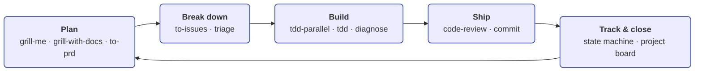
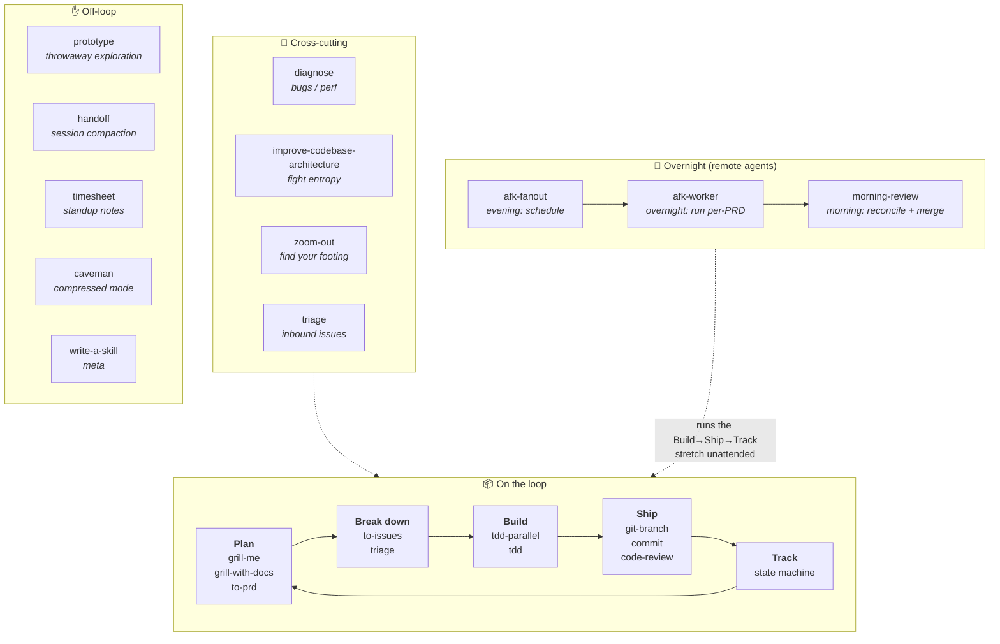
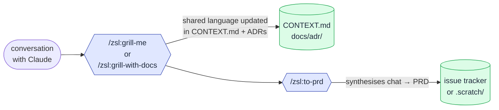
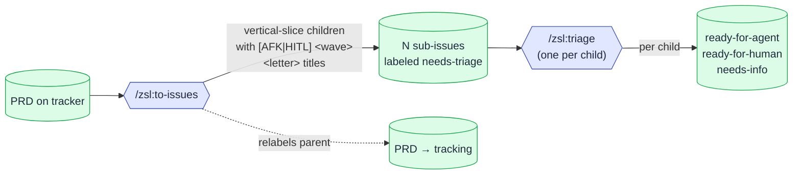
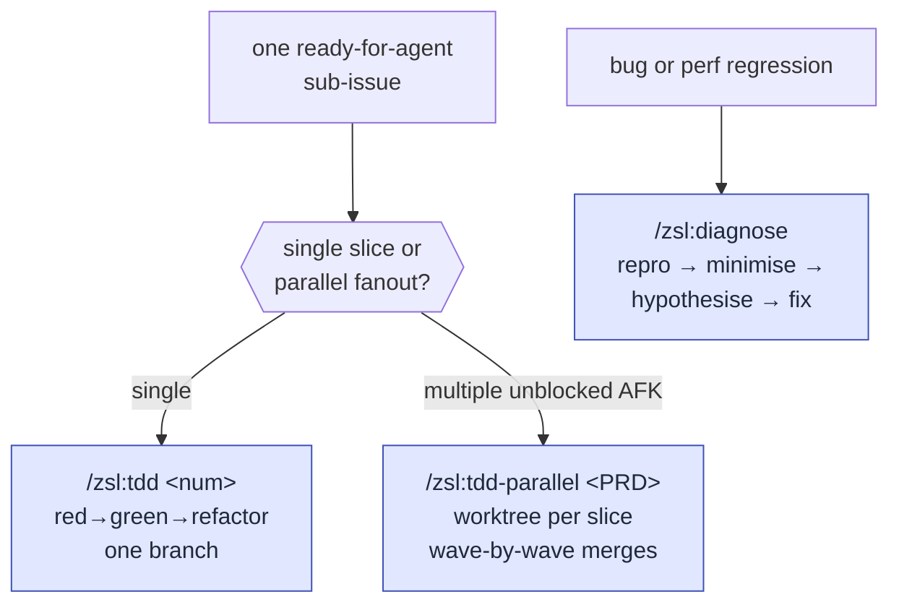
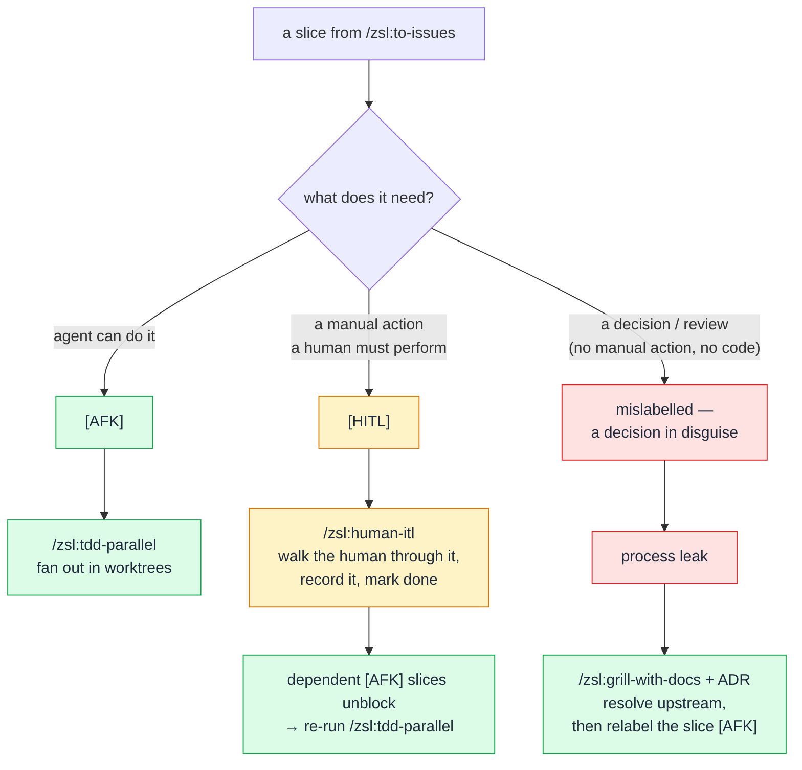
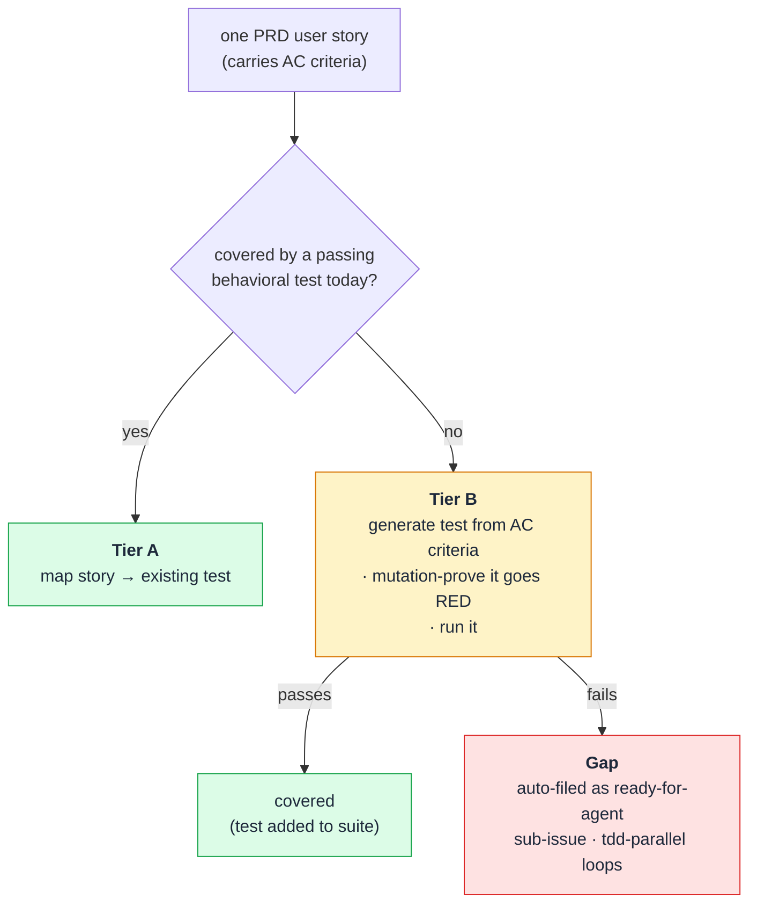
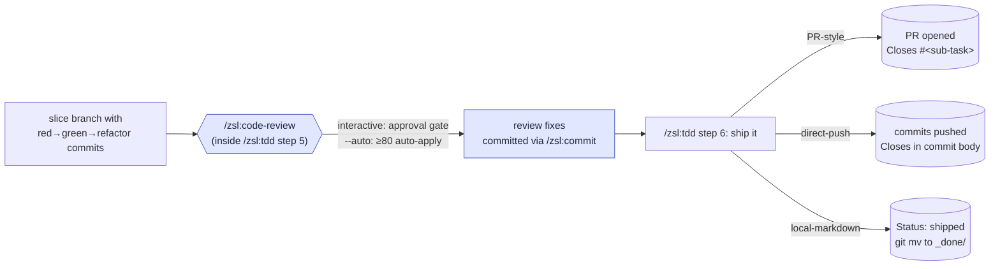

# The loop

The skills compose into one end-to-end engineering loop: **plan → break
down → build → ship → track**. Most days you only touch a few of them.
This is the canonical walkthrough — concept *and* command for every phase.

Run [`/zsl:setup-zsl-superpowers`](setup.md) once per repo before any of
this; from then on it's the loop:

Each phase produces an artifact the next one consumes:

| Phase | Produces | Consumed by |
|---|---|---|
| **Plan** | A PRD issue on the tracker (or a `.scratch/<NNN>-<feature-slug>/PRD.md`) describing what you're building and why | Break down |
| **Break down** | Vertical-slice sub-issues with `[AFK\|HITL] <wave><letter>` titles and `Blocked by` graphs, each triaged to a state | Build |
| **Build** | Slice branches with red-green-refactor commits, each closing one sub-issue | Ship |
| **Ship** | A merged PR (or pushed commit) per slice, *or* one consolidated integration PR for an AFK fanout | Track |
| **Track & close** | Closed issues. The PRD parent auto-closes when its last child closes. | Next loop |

## Loop skills vs the bands around it

Some skills sit *on* the loop arrow; others run *across* it, automate it
overnight, or sit off it entirely.

## One-time setup

[`/zsl:setup-zsl-superpowers`](setup.md)
:   Configure the issue tracker, triage label vocabulary, domain doc layout, and ship style for the repo. Run once before anything else.

## Plan

[`/zsl:grill-me`](skills/grill-me.md) or [`/zsl:grill-with-docs`](skills/grill-with-docs.md)
:   Interview yourself to surface what you're actually building, until every branch of the decision tree is resolved. `grill-with-docs` also updates `CONTEXT.md` (the shared language) and ADRs (the decisions) inline — the lever that cuts agent verbosity over time.

[`/zsl:to-prd`](skills/to-prd.md)
:   Synthesise that conversation into a PRD on the tracker. No interview — just packaging what you've already discussed.

!!! tip "The grilling step is the highest-leverage one"
    The most common failure mode in agent-coded software is misalignment —
    you think the agent knows what you want, then you see what it built.
    Five minutes here costs orders of magnitude less than re-doing work
    later. See [Why these skills exist](why.md#1-the-agent-didnt-do-what-i-want).

## Break down

[`/zsl:to-issues`](skills/to-issues.md)
:   Break the PRD into vertical-slice sub-issues. Children are labeled `needs-triage`; the PRD parent is auto-relabeled to `tracking`.

The `[AFK|HITL] <wave><letter>` title format is the **dependency
contract** the rest of the loop consumes:

- `[AFK]` — the agent can run it unattended.
- `[HITL]` — needs a manual action an agent can't perform (cleared by [`/zsl:human-itl`](skills/human-itl.md), not a disguised decision).
- `<wave>` — serialisation level (wave 1 before wave 2).
- `<letter>` — parallelism within a wave (same wave = disjoint = runnable in parallel).

[`/zsl:triage`](skills/triage.md)
:   Walk **each child** through the [state machine](concepts/state-machine.md) to `ready-for-agent` (with an agent brief), `ready-for-human`, or `needs-info`. Skip triaging the PRD itself; you just wrote it.

## Build

This is where the two TDD skills diverge — see
[Git branching](concepts/branching.md) for the full topology.

[`/zsl:tdd-parallel`](tdd-parallel.md) `<PRD>`
:   The full-auto pipeline from a PRD to a pushed integration PR. It fans out the unblocked **`[AFK]`** `ready-for-agent` children into parallel `/zsl:tdd --no-ship` sub-agents in worktrees, merges every slice branch onto the PRD branch in wave order with `--no-ff`, then runs two automated integration steps: **4a** `/zsl:code-review --auto` against the merged tip, **4b** `/zsl:verify-coverage --auto` to prove every user story has a test. Gaps found at 4b are filed as `ready-for-agent` and re-fanouted — the loop iterates until `gap=0` or a circuit breaker fires (`--max-coverage-rounds`, default 3). On clean coverage, **4c** delegates the commit to `/zsl:commit`, pushes, and opens **one** consolidated PR. Pre-flight (1d) refuses up front only if *no* slice is runnable or an in-scope story lacks an `AC<n>:` acceptance criterion. PR-style repos only. See the [deep-dive](tdd-parallel.md).

[`/zsl:tdd`](skills/tdd.md) `<child>`
:   Single-issue red-green-refactor. Refuses if you point it at a container. Runs [`/zsl:code-review`](skills/code-review.md) automatically between Refactor and Ship (step 5). **On local-markdown trackers you can run it with no argument** — it scans `.scratch/`, resolves each open issue's `## Blocked by` against the `issues/_done/` archive, and lets you pick from the unblocked ones.

### How a slice routes by type

The `[AFK|HITL]` prefix isn't decoration — it decides *which* skill picks
the slice up. A slice is one of three things, and only two of them are
work:

[`/zsl:human-itl`](skills/human-itl.md) `<PRD>`
:   The serial, human-present counterpart to the fanout. It walks you through the `[HITL]` slices — the manual actions a coding agent can't perform (console clicks, credential rotation, sign-off) — records each as an audit-trail comment, and marks them done so the `[AFK]` slices `Blocked by` them unblock. `/zsl:tdd-parallel` *defers* open `[HITL]` slices into a [`[partial]` PR](tdd-parallel.md#partial-runs-hitl-defers-it-doesnt-block) rather than blocking; clear them with `/zsl:human-itl`, then re-run the fanout. It hard-refuses a slice that's really a decision in disguise — that belongs upstream in `/zsl:grill-with-docs` + an ADR.

## Verify

[`/zsl:verify-coverage`](skills/verify-coverage.md) `<PRD>`
:   Check every PRD `## User Stories` entry against the *implemented code via tests*, not prose. Tier A maps each story to an existing passing behavioral test; Tier B generates one for the rest from the story's `AC<n>:` acceptance criteria, proves it non-vacuous by mutation, and runs it. Quarantines failing tests, auto-files genuine gaps as sub-issues, and writes a coverage receipt against the verified sha. Almost always chained automatically by `/zsl:tdd-parallel` step 4b (gaps filed as `ready-for-agent`, orchestrator loops on them); direct invocation is for auditing PRDs whose slices shipped elsewhere. There's no human-attestation lane — non-automatable stories are refused at `/zsl:to-prd` time, so visual/UX/external work splits into a separate PRD that doesn't go through `/zsl:tdd-parallel`.

## Ship

Most of what looks like "ship" happens *inside* `/zsl:tdd` — by the time
you reach the ship step, the slice has already been red-green-refactored
and reviewed (step 5, between Refactor and Ship).

[`/zsl:code-review`](skills/code-review.md)
:   A six-lens parallel scan (clean-code, CLAUDE.md compliance, git history, prior PR comments, inline comments, spec alignment against the originating PRD), 0–100 confidence-scored, dropping findings below 60. Runs automatically as `/zsl:tdd` step 5 (interactive, with an approval gate) or in `--auto` mode under `/zsl:tdd --no-ship` and `/zsl:tdd-parallel` step 4a. Also standalone before opening a PR by hand. See the [code-review deep-dive](code-review.md).

[`/zsl:commit`](skills/commit.md)
:   Clean, attribution-free commits — fully autonomous for session changes (no per-commit approval prompt). Explicit file lists, never `git add -A`; confirms only "other-origin" dirty files (modified outside this conversation) before including.

[`/zsl:commit-push-pr`](skills/commit-push-pr.md)
:   One-shot ship for a whole feature branch: pre-flight refuses on the default branch, delegates the commit to `/zsl:commit`, then `git push -u`, then opens the PR via `gh`. No force-push, no `--no-verify`, no Claude attribution.

[`/zsl:git-branch`](skills/git-branch.md)
:   Create a correctly-prefixed branch (`feature/`, `fix/`, `chore/`…) before `/zsl:tdd` when you don't already have one.

Ship behaviour depends on `docs/agents/ship-style.md` (written by
[`/zsl:setup-zsl-superpowers`](setup.md)). See
[Git branching](concepts/branching.md) for the matrix.

## Track & close

Every issue carries one **category role** (`bug` or `enhancement`) and one
**state role**:

See [`/zsl:triage`](skills/triage.md) for transition policy and brief
templates. Where state lives, and how closure works, depends on the
backend you picked in [`/zsl:setup-zsl-superpowers`](setup.md):

**GitHub project dashboard** — state lives as labels on each issue and is
mirrored to the project board's `Status` field via the mapping in
`docs/agents/project-board.md`. `/zsl:triage` updates both. PR merge →
GitHub closes the child; last child closes → GitHub auto-closes the
`tracking` parent.

**Local markdown files** — state lives as a `Status:` line near the top of
each `.md` file under `.scratch/<NNN>-<feature-slug>/`, where `<NNN>` is a
3-digit feature number assigned at creation. Features can be addressed by
number alone — `/zsl:triage 23` resolves to feature `023-*` via glob.
Closure is folder-based, atomic with the slice commit, and nothing is
deleted:

- Close an issue → on ship, [`/zsl:tdd`](skills/tdd.md) flips the `Status:` line to `shipped` and `git mv`s the issue file into `issues/_done/` in the same commit as the code.
- Close a feature → move the whole `.scratch/<NNN>-<feature-slug>/` directory to `.scratch/_done/<YYYYMMDD>-<NNN>-<feature-slug>/`. There's no auto-close: when an issue's close empties the feature's open `issues/`, `/zsl:tdd` **prompts** you to run the feature-level `git mv` (never automatic — you might still want to add a follow-up issue).

See [the state machine page](concepts/state-machine.md) for the full
transition policy.

## Overnight (remote agents)

Everything above is the **interactive** loop. Once a PRD is sliced and
triaged, the Build → Ship → Track stretch can also run **unattended
overnight** — one dedicated remote claude.ai session per PRD, so several
`/zsl:tdd-parallel` runs happen in parallel without contending on a shared
checkout. Three skills, evening to morning:

[`/zsl:afk-fanout`](skills/afk-fanout.md)
:   Evening, interactive. Shows the queue of `tracking` PRDs with `ready-for-agent` children; you pick which to run and in what order; it schedules one one-shot remote routine per PRD a fixed 2h apart.

[`/zsl:afk-worker`](skills/afk-worker.md)
:   What each routine fires (not invoked by hand). Runs unattended in its own clone, drives `/zsl:tdd-parallel <num> --on-review-failure=continue --max 2`, opens one integration PR, records its outcome on the `afk-runs` ledger.

[`/zsl:morning-review`](skills/morning-review.md)
:   Morning, interactive. Reconciles the ledger into the canonical `.scratch/` tracker, then walks you through the PRs to verify and merge, halted slices, and no-result PRDs. Never auto-merges; never deploys.

The enabler is `/zsl:tdd-parallel`'s **partial runs**: a worker never
stalls on a human gate because open `[HITL]` slices are deferred into a
`[partial]` PR. **See the [Remote agents deep-dive](remote-agents.md)**
for the full design — one-session-per-PRD isolation, the 2h throttle, the
ledger, and the morning sweep.

## Cross-cutting

These don't belong to a single phase — they run *across* the loop:

| Skill | When to reach for it |
|---|---|
| [`/zsl:triage`](skills/triage.md) | Inbound bug reports / feature requests, or re-evaluating stale issues — not just the children you sliced. |
| [`/zsl:diagnose`](skills/diagnose.md) | Hard bugs and performance regressions, whatever phase you're in. |
| [`/zsl:improve-codebase-architecture`](skills/improve-codebase-architecture.md) | Every few days, to fight entropy. Surfaces deepening opportunities informed by `CONTEXT.md` + ADRs. |
| [`/zsl:zoom-out`](skills/zoom-out.md) | When you're lost in a section of code and need higher-level framing. |

## Cleanup

After children merge, manually run `git worktree remove` and `git branch
-d` to clean up the parallel-tdd worktrees and branches (the next
`/zsl:tdd-parallel` run also sweeps these in its pre-flight).

## Catalogue at a glance

For the full per-skill descriptions and decision tree, see the
[Skills overview](skills/index.md).

| Phase | Skill | What it does |
|---|---|---|
| Setup | [setup-zsl-superpowers](skills/setup-zsl-superpowers.md) | One-time per-repo scaffold: tracker, label vocab, ship style |
| Plan | [grill-with-docs](skills/grill-with-docs.md) | Interview + updates `CONTEXT.md` and ADRs |
| Plan | [grill-me](skills/grill-me.md) | Interview only (non-code) |
| Plan | [to-prd](skills/to-prd.md) | Conversation → PRD on tracker |
| Break down | [to-issues](skills/to-issues.md) | PRD → vertical-slice children with wave/letter dependency graph |
| Break down | [triage](skills/triage.md) | Walk each child through the [state machine](concepts/state-machine.md) |
| Build | [tdd](skills/tdd.md) | Single-issue red-green-refactor |
| Build | [tdd-parallel](tdd-parallel.md) | Worktree fanout + wave-ordered merges + one PR |
| Build | [human-itl](skills/human-itl.md) | Clear the `[HITL]` manual-action slices a PRD carries |
| Build | [diagnose](skills/diagnose.md) | Reproduce → minimise → hypothesise → fix |
| Verify | [verify-coverage](skills/verify-coverage.md) | PRD-story coverage via tests; gates the fanout's integration PR |
| Ship | [git-branch](skills/git-branch.md) | Branch with the prefix convention |
| Ship | [commit](skills/commit.md) | Explicit-file-list commits, autonomous for session changes |
| Ship | [commit-push-pr](skills/commit-push-pr.md) | One-shot: commit → `git push -u` → `gh pr create`; refuses on the default branch |
| Ship | [code-review](skills/code-review.md) | Six-lens parallel scan, 0–100 confidence (drops <60); interactive gate or `--auto` |
| Overnight | [afk-fanout](skills/afk-fanout.md) | Evening scheduler: queue `tracking` PRDs, one remote routine per PRD 2h apart |
| Overnight | [afk-worker](skills/afk-worker.md) | Per-PRD remote executor: own clone, `/tdd-parallel`, one PR, ledger + Telegram |
| Overnight | [morning-review](skills/morning-review.md) | Reconcile the `afk-runs` ledger; surface PRs, halted slices, no-result PRDs |
| Cross-cut | [improve-codebase-architecture](skills/improve-codebase-architecture.md) | Find deepening opportunities |
| Cross-cut | [zoom-out](skills/zoom-out.md) | Broader context on unfamiliar code |
| Off-loop | [prototype](skills/prototype.md) | Throwaway exploration |
| Off-loop | [handoff](skills/handoff.md) | Compact the current session into a tmp-dir handoff doc |
| Off-loop | [timesheet](skills/timesheet.md), [caveman](skills/caveman.md), [write-a-skill](skills/write-a-skill.md) | Productivity helpers |

## See also

- [Why these skills exist](why.md) — the failure modes the loop is built to fix.
- [The triage state machine](concepts/state-machine.md) — how issues move between states.
- [Git branching](concepts/branching.md) — what the Build phase does to your git tree.
- [Parallel TDD deep-dive](tdd-parallel.md) · [Code review deep-dive](code-review.md) · [Remote agents deep-dive](remote-agents.md).
