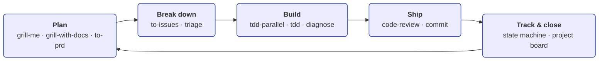
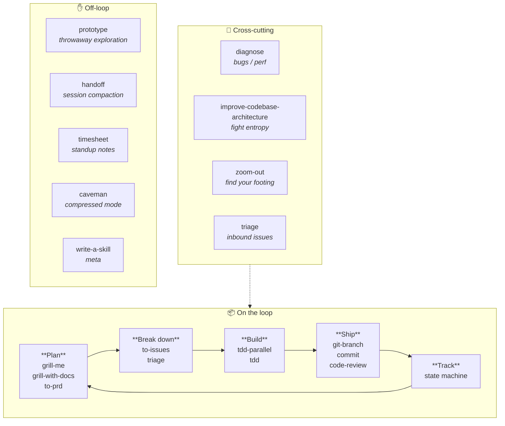
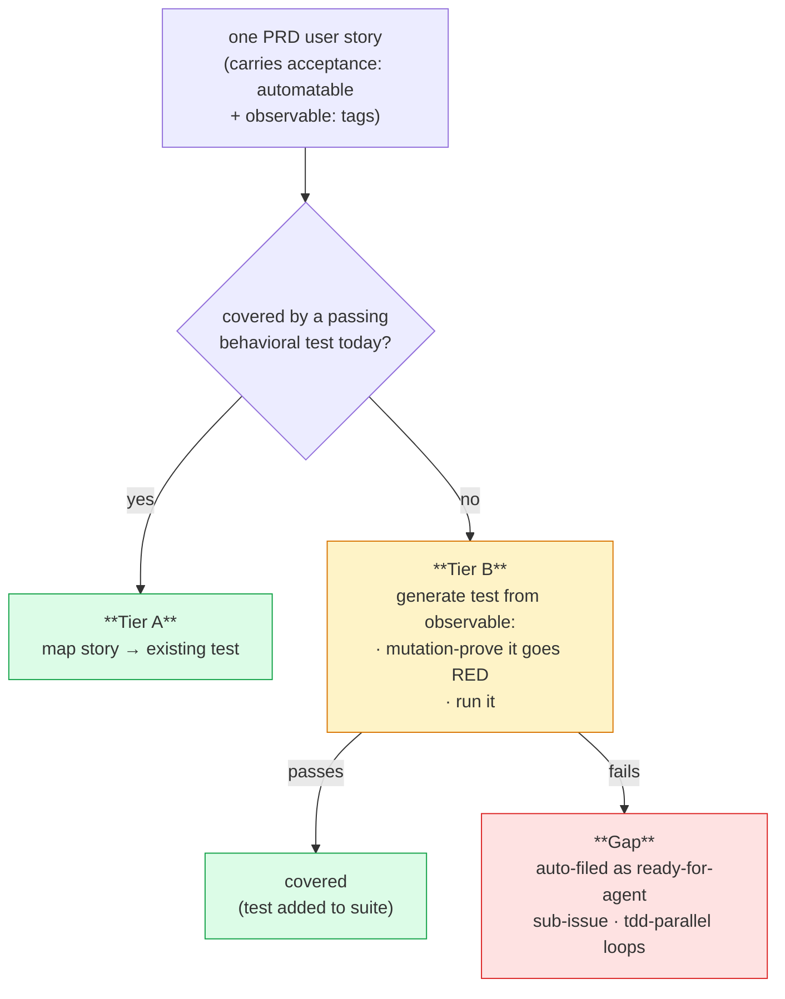
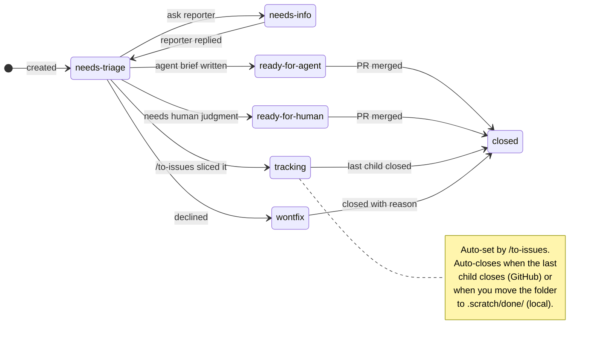

# The end-to-end loop

The skills compose into one engineering loop. Most days you only touch a few of them. Run [`/zsl:setup-zsl-superpowers`](setup.md) once per repo before any of this; from then on it's the loop:

!!! tip "Looking for the conceptual map?"
    This page is the walkthrough with slash-command examples. For the
    conceptual map — what each phase produces, what flows between them,
    the cross-cutting band — read [The loop](concepts/the-loop.md) in
    the "How it fits together" section.

## Loop skills vs cross-cutting helpers

Some skills sit *on* the loop arrow; others run *across* it. The lane
diagram below shows which is which — the second lane is the band of
skills you can reach for at any time, regardless of which phase you're
in.

## One-time setup

[`/zsl:setup-zsl-superpowers`](setup.md)
:   Configure the issue tracker, triage label vocabulary, domain doc layout, and ship style for the repo. Run once before anything else.

## Plan

[`/zsl:grill-me`](skills/grill-me.md) or [`/zsl:grill-with-docs`](skills/grill-with-docs.md)
:   Interview yourself to surface what you're actually building. `grill-with-docs` also updates `CONTEXT.md` and ADRs inline.

[`/zsl:to-prd`](skills/to-prd.md)
:   Synthesise that conversation into a PRD on the issue tracker.

## Break down

[`/zsl:to-issues`](skills/to-issues.md)
:   Break the PRD into vertical-slice sub-issues. Children are labeled `needs-triage`; the PRD parent is auto-relabeled to `tracking`. Slice titles use the `[AFK|HITL] <wave>[<letter>] — <description>` format so the dependency graph reads at a glance (same wave = runnable in parallel).

[`/zsl:triage`](skills/triage.md)
:   Triage **each child** to `ready-for-agent` (with an agent brief), `ready-for-human`, or `needs-info`. Skip triaging the PRD itself; you just wrote it.

## Build

[`/zsl:tdd-parallel`](tdd-parallel.md) `<PRD>`
:   Full-auto pipeline from a PRD to a pushed integration PR. Fans out the unblocked **`[AFK]`** `ready-for-agent` children into parallel `/tdd` sub-agents in worktrees; sub-agents commit but do **not** push (`/tdd --no-ship`). The orchestrator merges every slice branch onto the PRD branch in wave order with `--no-ff`, runs an integration `/zsl:code-review --auto` against the merged tip (step 4a), then auto-chains `/zsl:verify-coverage --auto` (step 4b). If verify-coverage finds gaps, they're filed as `ready-for-agent` sub-issues and re-fanouted in the next round — the loop iterates until `gap=0` or a circuit breaker fires (`--max-coverage-rounds`, default 3). On clean coverage, step 4c delegates the defensive commit pass to `/zsl:commit` then pushes and opens **one consolidated integration PR**. Pre-flight (1d) refuses up front if any `[HITL]` is open or any user story isn't `acceptance: automatable` — both gates exist to keep the post-invocation pipeline fully autonomous. PR-style repos only.

[`/zsl:human-itl`](skills/human-itl.md) `<PRD>`
:   Clear the `[HITL]` slices a PRD carries — the manual actions a coding agent can't perform (console clicks, credential rotation, sign-off). Records each as an audit-trail comment, marks them done so `/zsl:tdd-parallel`'s pre-flight stops refusing. Hard-refuses slices that are really decisions in disguise — those belong upstream in `/zsl:grill-with-docs` + an ADR. Run **before** `/zsl:tdd-parallel`, not interleaved with it.

[`/zsl:tdd`](skills/tdd.md) `<child>`
:   Single-issue red-green-refactor. Refuses if you point it at a container. **On local-markdown trackers, you can also run `/zsl:tdd` with no argument** — it scans `.scratch/`, resolves each open issue's `## Blocked by` against the `issues/done/` archive, and lets you pick from the unblocked ones. The picker also surfaces "features fully archived but not closed" so you can run the feature-level close before grabbing more work.

## Verify

[`/zsl:verify-coverage`](skills/verify-coverage.md) `<PRD>`
:   Check every PRD `## User Stories` entry against the *implemented code via tests*, not prose. Tier A maps each story to an existing passing behavioral test; Tier B generates one for the rest, proves it non-vacuous by mutation, and runs it. Quarantines failing tests, auto-files genuine gaps as sub-issues of the PRD, and writes a coverage receipt against the verified sha. Almost always chained automatically by `/zsl:tdd-parallel` step 4b in `--auto` mode (where gaps are filed as `ready-for-agent` directly and the orchestrator loops on them); direct user invocation is for auditing PRDs whose slices shipped via a different path. There is no longer a human-attestation HITL lane — non-automatable stories are refused at `/zsl:to-prd` time (every story must carry `acceptance: automatable` + `observable: <description>` tags) so visual/UX/external work is split into a separate PRD that doesn't go through `/zsl:tdd-parallel`.

Per-story routing:

## Ship

Each `/zsl:tdd` reads `docs/agents/ship-style.md`. PR-style opens a PR per slice; direct-push pushes the feature branch and you merge by hand. Review happens automatically inside `/zsl:tdd` step 5, between Refactor (step 4) and Ship (step 6) — by the time you reach the PR-open step the slice has already been reviewed.

[`/zsl:commit`](skills/commit.md) for clean, attribution-free commits — fully autonomous for session changes (no per-commit approval prompt); confirms only "other-origin" dirty files before including.

[`/zsl:code-review`](skills/code-review.md) fires a six-lens parallel scan (clean-code, CLAUDE.md compliance, git history, prior PR comments, inline comments, and spec alignment against the originating PRD), confidence-scores 0–100, and drops findings below 60. It runs automatically as `/zsl:tdd` step 5 (interactive mode with an approval gate) or in `--auto` mode under `/zsl:tdd --no-ship` and `/zsl:tdd-parallel` step 4a. You can also invoke it standalone before opening a PR — same scan, same scoring. See [the code-review deep-dive](code-review.md) for the lens layout and confidence model.

## Cleanup

After children merge, manually run `git worktree remove` and `git branch -d` to clean up the parallel-tdd worktrees and branches (the next `/zsl:tdd-parallel` run also sweeps these in its pre-flight).

## Track and close

Every issue carries one **category role** (`bug` or `enhancement`) and one **state role**:

See [`/zsl:triage`](skills/triage.md) for transition policy and brief templates.

Where state lives, and how closure works, depends on the backend you picked in [`/zsl:setup-zsl-superpowers`](setup.md):

**GitHub project dashboard** — state lives as labels on each issue and is mirrored to the project board's `Status` field via the mapping in `docs/agents/project-board.md`. `/zsl:triage` updates both. When a child issue's PR merges, GitHub closes the child; when the last child of a `tracking` PRD closes, GitHub auto-closes the parent — no manual transition needed.

**Local markdown files** — state lives as a `Status:` line near the top of each `.md` file under `.scratch/<NNN>-<feature-slug>/`, where `<NNN>` is a 3-digit feature number assigned at creation (auto-incremented from the highest existing number across active + archived). Features can be addressed by number alone — `/zsl:triage 23` and `/zsl:to-issues 45` resolve to features `023-*` and `045-*` via glob. Closure is folder-based, and nothing is deleted:

- Close an issue → on ship, [`/zsl:tdd`](skills/tdd.md) flips the `Status:` line to `shipped` and runs `git mv .scratch/<NNN>-<feature-slug>/issues/<NN>-<slug>.md .scratch/<NNN>-<feature-slug>/issues/done/<NN>-<slug>.md` in the same commit as the slice's code, so the close is atomic with the work that earned it. The filename and `Status:` line are preserved so the archive records why it closed (e.g. `shipped` vs `wontfix`).
- Close a feature → move the whole `.scratch/<NNN>-<feature-slug>/` directory to `.scratch/done/<YYYYMMDD>-<NNN>-<feature-slug>/`, preserving its internal layout. The date prefix orders archived features chronologically (`ls .scratch/done/` shows close order); the feature number stays embedded so number-based lookup keeps working across the active/archive split. There's no auto-close: when an issue's close empties the feature's open `issues/`, [`/zsl:tdd`](skills/tdd.md) **prompts** you to run the feature-level `git mv` (never automatic — you might still want to add a follow-up issue). You can also do it by hand if you're abandoning the feature.

## Cross-cutting

[`/zsl:triage`](skills/triage.md) is also the entry point for **inbound issues** (bugs, feature requests from others) and re-evaluating stale ones — not just for the children you just sliced.

[`/zsl:diagnose`](skills/diagnose.md) for hard bugs and performance regressions.

[`/zsl:improve-codebase-architecture`](skills/improve-codebase-architecture.md) every few days to fight entropy.

[`/zsl:zoom-out`](skills/zoom-out.md) when you need a higher-level view of unfamiliar code.

## Catalogue at a glance

For the full per-skill descriptions and decision tree, see the
[Skills overview](skills/index.md).

| Phase | Skill | What it does |
|---|---|---|
| Setup | [setup-zsl-superpowers](skills/setup-zsl-superpowers.md) | One-time per-repo scaffold: tracker, label vocab, ship style |
| Plan | [grill-with-docs](skills/grill-with-docs.md) | Interview + updates `CONTEXT.md` and ADRs |
| Plan | [grill-me](skills/grill-me.md) | Interview only (non-code) |
| Plan | [to-prd](skills/to-prd.md) | Conversation → PRD on tracker |
| Break down | [to-issues](skills/to-issues.md) | PRD → vertical-slice children with wave/letter dependency graph |
| Break down | [triage](skills/triage.md) | Walk each child through the [state machine](concepts/state-machine.md) |
| Build | [tdd](skills/tdd.md) | Single-issue red-green-refactor |
| Build | [tdd-parallel](skills/tdd-parallel.md) | Worktree fanout + wave-ordered merges + one PR |
| Build | [diagnose](skills/diagnose.md) | Reproduce → minimise → hypothesise → fix |
| Verify | [verify-coverage](skills/verify-coverage.md) | PRD-story coverage via tests; gates the fanout's integration PR |
| Ship | [git-branch](skills/git-branch.md) | Branch with the prefix convention |
| Ship | [commit](skills/commit.md) | Explicit-file-list commits, autonomous for session changes |
| Ship | [code-review](skills/code-review.md) | Six-lens parallel scan (clean-code / CLAUDE.md compliance / git history / prior PR comments / inline comments / spec alignment), 0–100 confidence scoring (drops <60); interactive approval gate or `--auto` |
| Cross-cut | [improve-codebase-architecture](skills/improve-codebase-architecture.md) | Find deepening opportunities |
| Cross-cut | [zoom-out](skills/zoom-out.md) | Broader context on unfamiliar code |
| Off-loop | [prototype](skills/prototype.md) | Throwaway exploration |
| Off-loop | [handoff](skills/handoff.md) | Compact the current session into a tmp-dir handoff doc for the next agent |
| Off-loop | [timesheet](skills/timesheet.md), [caveman](skills/caveman.md), [write-a-skill](skills/write-a-skill.md) | Productivity helpers |
