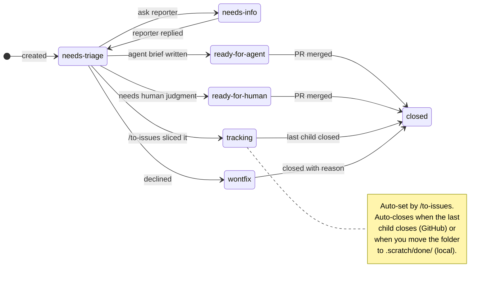

# The end-to-end loop

The skills compose into one engineering loop. Most days you only touch a few of them. Run [`/zsl:setup-zsl-superpowers`](setup.md) once per repo before any of this; from then on it's the loop:

```mermaid
flowchart LR
    plan["`**Plan**
    grill-me · grill-with-docs · to-prd`"]
    breakdown["`**Break down**
    to-issues · triage`"]
    build["`**Build**
    tdd-parallel · tdd · diagnose`"]
    ship["`**Ship**
    code-review · commit`"]
    track["`**Track & close**
    state machine · project board`"]

    plan --> breakdown --> build --> ship --> track --> plan

    classDef phase fill:var(--md-default-bg-color),stroke:var(--md-primary-fg-color),stroke-width:1.5px,color:var(--md-default-fg-color),rx:6,ry:6;
    class plan,breakdown,build,ship,track phase;
```

## One-time setup

[`/zsl:setup-zsl-superpowers`](setup.md)
:   Configure the issue tracker, triage label vocabulary, domain doc layout, and ship style for the repo. Run once before anything else.

## Plan

[`/zsl:grill-me`](skills/grill-me.md) or [`/zsl:grill-with-docs`](skills/grill-with-docs.md)
:   Interview yourself to surface what you're actually building. `grill-with-docs` also updates `CONTEXT.md` and ADRs inline.

[`/zsl:to-prd`](skills/to-prd.md)
:   Synthesise that conversation into a PRD on the issue tracker.

## Break down

[`/zsl:to-issues`](skills/to-issues.md)
:   Break the PRD into vertical-slice sub-issues. Children are labeled `needs-triage`; the PRD parent is auto-relabeled to `tracking`. Slice titles use the `[AFK|HITL] <wave>[<letter>] — <description>` format so the dependency graph reads at a glance (same wave = runnable in parallel).

[`/zsl:triage`](skills/triage.md)
:   Triage **each child** to `ready-for-agent` (with an agent brief), `ready-for-human`, or `needs-info`. Skip triaging the PRD itself; you just wrote it.

## Build

[`/zsl:tdd-parallel`](tdd-parallel.md) `<PRD>`
:   Fan out the unblocked **`[AFK]`** `ready-for-agent` children into parallel `/tdd` sub-agents in worktrees. Sub-agents commit but do **not** push (`/tdd --no-ship`). The orchestrator merges every slice branch onto the PRD branch in wave order with `--no-ff`, then opens **one consolidated integration PR**. Halts with a structured RCA on agent failure, merge conflict, or zero-progress cycles. PR-style repos only; `[HITL]`, container, and blocked items are skipped.

[`/zsl:tdd`](skills/tdd.md) `<child>`
:   Single-issue red-green-refactor. Refuses if you point it at a container.

## Ship

Each `/zsl:tdd` reads `docs/agents/ship-style.md`. PR-style opens a PR per slice; direct-push pushes the feature branch and you merge by hand.

[`/zsl:commit`](skills/commit.md) for clean, attribution-free commits.

[`/zsl:code-review`](skills/code-review.md) before opening the PR.

## Cleanup

After children merge, manually run `git worktree remove` and `git branch -d` to clean up the parallel-tdd worktrees and branches (the next `/zsl:tdd-parallel` run also sweeps these in its pre-flight).

## Track and close

Every issue carries one **category role** (`bug` or `enhancement`) and one **state role**:



See [`/zsl:triage`](skills/triage.md) for transition policy and brief templates.

Where state lives, and how closure works, depends on the backend you picked in [`/zsl:setup-zsl-superpowers`](setup.md):

**GitHub project dashboard** — state lives as labels on each issue and is mirrored to the project board's `Status` field via the mapping in `docs/agents/project-board.md`. `/zsl:triage` updates both. When a child issue's PR merges, GitHub closes the child; when the last child of a `tracking` PRD closes, GitHub auto-closes the parent — no manual transition needed.

**Local markdown files** — state lives as a `Status:` line near the top of each `.md` file under `.scratch/<feature-slug>/`. Closure is folder-based, and nothing is deleted:

- Close an issue → move `.scratch/<feature-slug>/issues/<NN>-<slug>.md` to `.scratch/<feature-slug>/issues/done/<NN>-<slug>.md`. The filename and final `Status:` line are preserved so the archive records why it closed (e.g. shipped from `ready-for-agent` vs `wontfix`).
- Close a feature → move the whole `.scratch/<feature-slug>/` directory to `.scratch/done/<feature-slug>/`, preserving its internal layout. There's no auto-close: move the feature explicitly once all its issues sit in `issues/done/` (or you've decided to abandon it).

## Cross-cutting

[`/zsl:triage`](skills/triage.md) is also the entry point for **inbound issues** (bugs, feature requests from others) and re-evaluating stale ones — not just for the children you just sliced.

[`/zsl:diagnose`](skills/diagnose.md) for hard bugs and performance regressions.

[`/zsl:improve-codebase-architecture`](skills/improve-codebase-architecture.md) every few days to fight entropy.

[`/zsl:zoom-out`](skills/zoom-out.md) when you need a higher-level view of unfamiliar code.
