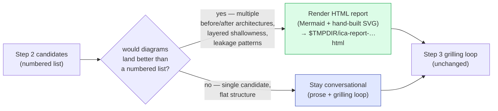

# Improve Codebase Architecture

Surface architectural friction and propose **deepening opportunities** — refactors that turn shallow modules into deep ones. The aim is testability and AI-navigability.

## Vocabulary

Use the deep-module design language in every suggestion — **module**, **interface**, **depth**, **seam**, **adapter**, **leverage**, **locality** — exactly. Consistent language is the point; don't drift into "component," "service," "API," or "boundary." The full vocabulary, the **deletion test**, the "interface is the test surface" principle, and the **one-adapter-hypothetical / two-adapters-real** refinement all live in [`codebase-design`](../codebase-design/SKILL.md) — compose it rather than re-defining the terms here.

This skill is _informed_ by the project's domain model. The domain language gives names to good seams; ADRs record decisions the skill should not re-litigate.

## Process

### 1. Explore

Read the project's domain glossary and any ADRs in the area you're touching first.

Then use the Agent tool with `subagent_type=Explore` to walk the codebase. Don't follow rigid heuristics — explore organically and note where you experience friction:

- Where does understanding one concept require bouncing between many small modules?
- Where are modules **shallow** — interface nearly as complex as the implementation?
- Where have pure functions been extracted just for testability, but the real bugs hide in how they're called (no **locality**)?
- Where do tightly-coupled modules leak across their seams?
- Which parts of the codebase are untested, or hard to test through their current interface?

Apply the **deletion test** to anything you suspect is shallow: would deleting it concentrate complexity, or just move it? A "yes, concentrates" is the signal you want.

### 2. Present candidates

Present a numbered list of deepening opportunities. For each candidate:

- **Files** — which files/modules are involved
- **Problem** — why the current architecture is causing friction
- **Solution** — plain English description of what would change
- **Benefits** — explained in terms of locality and leverage, and also in how tests would improve

**Use CONTEXT.md vocabulary for the domain, and [`codebase-design`](../codebase-design/SKILL.md) vocabulary for the architecture.** If `CONTEXT.md` defines "Order," talk about "the Order intake module" — not "the FooBarHandler," and not "the Order service."

**ADR conflicts**: if a candidate contradicts an existing ADR, only surface it when the friction is real enough to warrant revisiting the ADR. Mark it clearly (e.g. _"contradicts ADR-0007 — but worth reopening because…"_). Don't list every theoretical refactor an ADR forbids.

Do NOT propose interfaces yet. Ask the user: "Which of these would you like to explore?"

### 3. Grilling loop

Once the user picks a candidate, drop into a grilling conversation. Walk the design tree with them — constraints, dependencies, the shape of the deepened module, what sits behind the seam, what tests survive.

Side effects happen inline as decisions crystallize:

- **Naming a deepened module after a concept not in `CONTEXT.md`?** Add the term to `CONTEXT.md` — same discipline as `/grill-with-docs` (see [CONTEXT-FORMAT.md](../grill-with-docs/CONTEXT-FORMAT.md)). Create the file lazily if it doesn't exist.
- **Sharpening a fuzzy term during the conversation?** Update `CONTEXT.md` right there.
- **User rejects the candidate with a load-bearing reason?** Offer an ADR, framed as: _"Want me to record this as an ADR so future architecture reviews don't re-suggest it?"_ Only offer when the reason would actually be needed by a future explorer to avoid re-suggesting the same thing — skip ephemeral reasons ("not worth it right now") and self-evident ones. See [ADR-FORMAT.md](../grill-with-docs/ADR-FORMAT.md).
- **Want to explore alternative interfaces for the deepened module?** See the "Designing it twice" parallel sub-agent pattern in [`codebase-design`](../codebase-design/SKILL.md).

### 4. Render the HTML report (optional)

After the candidates are listed in step 2, the user may ask for a visual report (or you may offer one when the candidates would land better as diagrams than as a numbered list — multiple before/after architectures, leakage patterns, layered shallowness).

Render the candidates as a single self-contained HTML file in the OS temp directory — see [HTML-REPORT.md](HTML-REPORT.md) for the scaffold, diagram patterns (Mermaid + hand-built SVG mixed), style guidance, and the strict glossary rules the prose must follow.

The HTML report is an output format, not a replacement for the conversation. Present the candidates inline first; the report is for when the user wants something to refer back to, share with a teammate, or use as a thinking surface while deciding which deepening to actually do.

<!-- BEGIN bundled-book-rules -->

## Bundled book rules

Do not hand-edit content between the `BEGIN`/`END` markers — `scripts/sync_book_rules.py` overwrites it from `vendor/agent-rules-books/`.

### Rules from "A Philosophy of Software Design" by John Ousterhout

<!-- BEGIN a-philosophy-of-software-design.mini.md v0.5 -->

# OBEY A Philosophy of Software Design by John Ousterhout

## When to use

Use for module design, API changes, decomposition, refactoring, naming, comments, tests, performance work, and changes that feel awkward or spread complexity across files.

## Primary bias to correct

Working code, small pieces, familiar patterns, flags, wrappers, and extra documentation do not make a design simple when they increase cognitive load or leak knowledge.

## Decision rules

- Use reduced complexity as the primary success metric. Prefer the design that lowers cognitive load, change amplification, hidden dependencies, temporal coupling, and the number of facts a reader must hold at once.
- Treat design as continuous work. A first working patch is not done if it worsens future changeability; compare plausible alternatives for non-trivial interface, decomposition, or abstraction choices.
- Prefer deep modules: small, semantic interfaces that hide meaningful internal complexity. Reject pass-through services, thin library wrappers, helper modules, and tiny split-outs that add names without reducing reader burden.
- Design interfaces around what callers need to know, not how the implementation works. Avoid fragile staging, setup sequences, mode flags, configuration knobs, and arguments that expose internal choices.
- Hide volatile decisions, internal representations, storage shape, protocols, file formats, performance hacks, bookkeeping, normalization, and messy edge handling inside the module that owns the knowledge.
- Pull complexity downward when the lower module owns the detail. Prefer a slightly more complex implementation if it gives callers a simpler public contract and removes repeated reasoning from call sites.
- Choose generality at the right level. Avoid one-caller overfitting, vague speculative abstractions, and core paths polluted by rare edge cases; isolate special behavior with special-general decomposition.
- Combine or split by total complexity, not by size, runtime order, habit, or aesthetics. Keep related state, behavior, invariants, and design decisions together unless the new boundary is deeper and independently understandable.
- Reduce exception surface by changing interfaces or invariants where possible. Define away invalid states and awkward cases instead of making every caller repeat defensive ceremony.
- Use comments to reduce complexity: document interface contracts, invariants, hidden design decisions, rationale, and tricky implementation facts callers should not need to know. Do not narrate code or compensate for bad names, poor decomposition, or confusing flow.
- Treat names, consistency, and obviousness as design information. Names should reveal abstractions rather than mechanisms; related operations should share conventions; surprising code is complexity even when short.
- Use tests to protect behavior through public contracts and stable APIs, especially around hidden complexity and isolated special cases. Do not let test convenience force shallow or leaky interfaces.
- Add performance optimizations, trends, paradigms, patterns, or frameworks only when they reduce complexity in this codebase or evidence shows the tradeoff matters; hide optimization details behind stable interfaces.

## Trigger rules

- When a feature feels awkward, one change spreads across files, or reviewers must reconstruct hidden dependencies, look for missing information hiding, shallow modules, temporal coupling, or complexity pushed to callers.
- When adding a module, layer, service, helper, wrapper, facade, pattern, option, callback, or argument, prove that it hides more complexity than it adds.
- When touching an API, check whether ordinary callers must know sequencing, representation, storage, transport, caching, protocol, file format, internal workflow, or too many setup steps.
- When adding a special case, flag, exception path, conditional, or exposed container, first ask whether the owning module can eliminate the invalid state, isolate the unusual behavior, or provide a stronger operation.
- When splitting, extracting, or introducing variables, check whether the new boundary or name captures meaning or only adds jumps, pass-through state, and visible intermediate steps.
- When code is organized as `prepare/process/finalize`, staged objects, or other execution-order phases, verify that temporal structure is the real concept; otherwise reorganize around stable responsibilities.
- When naming is vague, mechanism-focused, inconsistent, or surprising, reconsider the abstraction boundary instead of accepting a near miss.
- When comments get long, duplicate code, justify a confusing interface, or explain usage by exposing internals, redesign the abstraction or move the missing contract to the interface.
- When optimizing performance, measure first and hide the optimization; do not sacrifice module depth or information hiding without evidence that the tradeoff matters.
- When testing or reviewing, focus on public behavior, interface contracts, hidden complexity through stable APIs, and special cases isolated behind the abstraction.

## Final checklist

- Did the change reduce the effort required to understand, modify, verify, and extend the system?
- Does every interface element, wrapper, layer, helper, option, and name hide enough complexity to justify its existence?
- Are important decisions localized, dependencies visible, caller-needed constraints documented, and mutable internals protected?
- Did common cases become automatic while rare controls, special cases, performance tricks, and exception details stayed out of the common path?
- Are names precise and consistent, comments current and non-duplicative, and conventions followed unless new information justified changing them?

<!-- END a-philosophy-of-software-design.mini.md -->

### Rules from "Clean Architecture" by Robert C. Martin

<!-- BEGIN clean-architecture.mini.md v0.5 -->

# OBEY Clean Architecture by Robert C. Martin

## When to use

Use when adding, changing, reviewing, or refactoring code whose business rules should survive changes in frameworks, databases, delivery mechanisms, services, devices, vendors, deployment shape, or schedule pressure.

## Primary bias to correct

Do not let details become the architecture. Business policy stays independent, dependencies point inward, and volatile mechanisms remain replaceable.

## Decision rules

- Preserve independent business rules, inward dependencies, testability, and replaceable details even when the immediate feature would be shorter without them.
- Source dependencies must point inward toward higher-level policy. Domain and use cases must not import frameworks, databases, web handlers, queues, external service clients, UI types, or other details.
- Put enterprise rules and invariants in entities or equivalent domain objects; put application-specific orchestration in focused use cases.
- Pass plain request and response models across use-case boundaries. Do not pass web requests, framework contexts, ORM rows, database-bound structures, or framework response objects into or out of core policy.
- Treat frameworks, databases, web delivery, messaging, filesystems, clocks, service clients, networks, devices, and vendors as outer-layer details behind ports, gateways, presenters, mappers, or adapters.
- Inner layers own the interfaces they need; outer layers implement them. Object construction and concrete wiring belong in the composition root or other outer-layer main component.
- Keep adapters humble. Controllers, endpoints, presenters, gateway adapters, service listeners, and hardware adapters translate external formats to use-case calls and back; they do not own business decisions.
- Organize by use case, feature, or business capability before generic technical buckets. The structure should reveal domain intent and application actions.
- Choose boundaries by volatility, policy importance, substitution value, testability, and cost. Use the lightest enforceable boundary, including partial boundaries, when full deployment or runtime separation is too expensive.
- Do not merge unrelated use cases or eliminate duplication when sharing would couple actors, change reasons, team ownership, deployment needs, or release pressure.
- Use structured code, dependency inversion, role-sized interfaces, substitutable implementations, controlled mutation, acyclic components, and stability-directed dependencies to protect policy from volatile details.
- Enforce boundaries with package structure, dependency rules, build constraints, tests, visibility, or narrow APIs. A diagram, service split, package name, or shared `common` folder is not enough.
- Test entities, use cases, and boundary contracts first, without the real framework, database, network, external service, or target hardware. Test adapters separately at the seams.
- Preserve behavior while improving dependency direction. Prefer incremental boundary extraction over rewrites, and call out architectural debt when it cannot be fixed safely now.

## Trigger rules

- When urgent delivery would skip architecture, state the future change, test, replacement, or operational cost before accepting the shortcut.
- When framework annotations, request/response objects, serializers, ORM rows, schemas, vendor SDKs, config, environment reads, device registers, or transport formats enter core policy, move translation outward.
- When controllers, jobs, handlers, views, presenters, gateways, repositories, SQL, service listeners, scripts, or hardware adapters contain business branching or validation, move the rule inward.
- When a use case instantiates infrastructure, calls a volatile dependency directly, or depends on a concrete implementation, introduce a policy-owned port and wire the concrete detail at the edge.
- When a `*Service`, utility folder, shared module, base package, or generic `core` package becomes an escape hatch, split by use case, role, or ownership and restore dependency direction.
- When an adapter bypasses a use case, a presenter reads persistence directly, or infrastructure is both imported by and importing inward code, restore the intended boundary.
- When service boundaries, process boundaries, remote calls, deployment boundaries, or embedded hardware appear, still verify source dependencies, data ownership, I/O cost, and policy independence.
- When tests need the framework, database, network, service, or hardware to verify business rules, move tests to use cases/entities with fakes or add a stable boundary contract.
- When a compromise is unavoidable, keep it at the outermost layer possible, document the violation, avoid normalizing it, and preserve a path to separation.

## Final checklist

- Business rules independent from frameworks, databases, UI, services, devices, and vendors?
- Dependencies point inward, with ports owned by inner policy and concrete details outside?
- Entities guard invariants and focused use cases orchestrate one application action?
- Boundaries explicit and enforced in code, tests, packages, or build rules?
- Controllers, presenters, gateways, service listeners, and adapters humble?
- Structure reveals use cases and business capabilities instead of generic technical buckets?
- Core tests run fast without real delivery, persistence, network, external service, or hardware?
- Details remain replaceable without rewriting business rules?

<!-- END clean-architecture.mini.md -->

<!-- END bundled-book-rules -->
