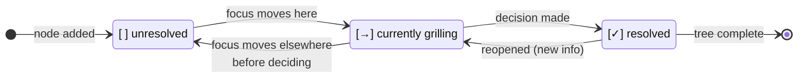

# Grilling

The shared engine for a relentless, one-question-at-a-time interview that walks a
**design tree** until every branch is resolved. One home for the protocol so the
markers, the example, the reprint rules, and the status lifecycle mean the same
thing in every skill that grills — `grill-me`, `grill-with-docs`, and anything
else that needs the interview loop composes this instead of carrying its own copy.

## The loop

Interview the user relentlessly about every aspect of the plan until you reach a
shared understanding. Walk down each branch of the design tree, resolving
dependencies between decisions one-by-one. For each question, provide your
recommended answer. Ask the questions **one at a time**, waiting for feedback on
each before continuing. If a question can be answered by exploring the codebase,
explore the codebase instead of asking.

## Design tree

Before the first question, print the design tree you intend to traverse — the
decisions and sub-decisions you've identified, with a status marker on each:

- `[ ]` unresolved
- `[→]` currently being grilled
- `[✓]` resolved

Example:

```
Design tree
├── [→] Auth strategy
│   ├── [ ] Session storage (cookie vs JWT)
│   └── [ ] Refresh-token rotation
├── [ ] Persistence layer
│   ├── [ ] Primary store
│   └── [ ] Migration path from current schema
└── [ ] Rollout
    ├── [ ] Feature-flag gate
    └── [ ] Backfill plan
```

Reprint the tree whenever it changes: a node is resolved, a new branch is
discovered, the focus moves to a new node, or scope shifts. Don't reprint between
every question — only when the shape or status actually changes. Always reprint
the full tree, not a diff, so progress is visible at a glance.

Status lifecycle for a single node:


